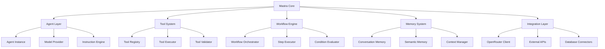
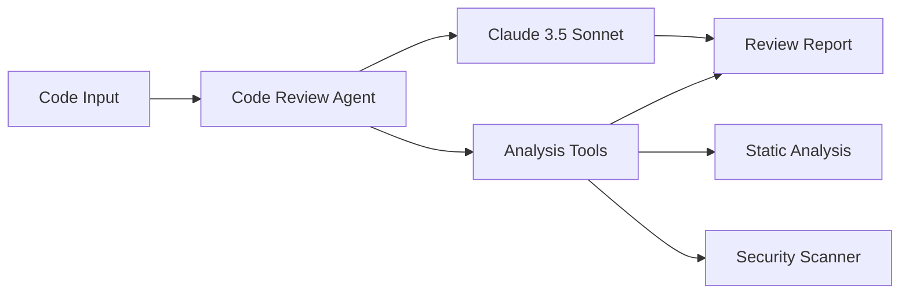

# Agent Architecture Patterns

## Purpose
This document defines architectural patterns and design principles for building TypeScript LLM agents using the Mastra framework, including component relationships, data flows, and integration strategies.

## Classification
- **Domain:** Architecture
- **Stability:** Semi-stable
- **Abstraction:** Structural
- **Confidence:** Established

## Content

### Agent Architecture Overview

#### Core Architectural Principles

1. **Modular Design**: Agents are composed of discrete, reusable components
2. **Separation of Concerns**: Clear boundaries between agent logic, tools, and workflows
3. **Dependency Injection**: Central configuration and component management
4. **Event-Driven Communication**: Asynchronous message passing between components
5. **Stateless Operations**: Agents maintain state through external memory systems

#### Agent Component Hierarchy



### Agent Design Patterns

#### Single-Purpose Agent Pattern

**Use Case**: Specialized agents focused on one specific task or domain

```typescript
// Example: Code Review Agent
export const codeReviewAgent = new Agent({
  name: 'CodeReviewAgent',
  instructions: `
    You are a senior software engineer specializing in code reviews.
    Focus on:
    - Code quality and maintainability
    - Security vulnerabilities
    - Performance optimizations
    - Best practices adherence
    
    Provide specific, actionable feedback with examples.
  `,
  model: {
    provider: 'OPEN_ROUTER',
    name: 'anthropic/claude-3-5-sonnet-20241022',
    temperature: 0.1, // Low temperature for consistent analysis
  },
  inputSchema: z.object({
    code: z.string(),
    language: z.string(),
    context: z.string().optional(),
  }),
  outputSchema: z.object({
    issues: z.array(z.object({
      type: z.enum(['bug', 'security', 'performance', 'style']),
      severity: z.enum(['low', 'medium', 'high', 'critical']),
      description: z.string(),
      suggestion: z.string(),
      lineNumber: z.number().optional(),
    })),
    overallScore: z.number().min(0).max(10),
    summary: z.string(),
  }),
  tools: {
    staticAnalysis: 'code-analysis-tool',
    securityScan: 'security-scanner-tool',
  },
});
```

**Architecture Diagram:**



#### Multi-Tool Agent Pattern

**Use Case**: Agents that can dynamically select and use multiple tools based on context

```typescript
// Example: Automation Agent
export const automationAgent = new Agent({
  name: 'AutomationAgent',
  instructions: `
    You are an intelligent automation specialist.
    Analyze user requests and determine the best tools to accomplish tasks.
    Always confirm destructive actions before executing.
    Provide clear status updates throughout the process.
  `,
  model: {
    provider: 'OPEN_ROUTER',
    name: 'anthropic/claude-3-5-sonnet-20241022',
    temperature: 0.2,
  },
  tools: {
    filesystem: 'fs-tool',
    github: 'github-integration',
    slack: 'slack-integration',
    database: 'db-tool',
    email: 'email-tool',
    calendar: 'calendar-tool',
  },
  memory: {
    type: 'thread',
    maxMessages: 100,
  },
});
```

**Tool Selection Logic:**

```typescript
// Dynamic tool selection based on intent
export class ToolSelector {
  selectTools(intent: string, context: any): string[] {
    const intentMap = {
      'file_management': ['filesystem'],
      'code_deployment': ['github', 'filesystem'],
      'team_communication': ['slack', 'email'],
      'data_analysis': ['database', 'filesystem'],
      'scheduling': ['calendar', 'email'],
      'full_automation': ['filesystem', 'github', 'slack', 'database'],
    };
    
    return intentMap[intent] || ['filesystem']; // Default fallback
  }
}
```

#### Workflow-Orchestrated Agent Pattern

**Use Case**: Agents that operate within structured workflows with multiple steps

```typescript
// Example: Content Publishing Workflow
export const contentPublishingWorkflow = createWorkflow({
  id: 'content-publishing',
  inputSchema: z.object({
    topic: z.string(),
    platform: z.enum(['blog', 'social', 'newsletter']),
    targetAudience: z.string(),
  }),
  outputSchema: z.object({
    publishedContent: z.object({
      title: z.string(),
      content: z.string(),
      publishUrl: z.string(),
    }),
    analytics: z.object({
      estimatedReach: z.number(),
      engagementPrediction: z.number(),
    }),
  }),
});

const researchStep = createStep({
  id: 'research-content',
  execute: async ({ inputData, mastra }) => {
    const researchAgent = mastra.getAgent('researchAgent');
    return await researchAgent.generate(`Research ${inputData.topic} for ${inputData.targetAudience}`);
  },
});

const writeStep = createStep({
  id: 'write-content',
  execute: async ({ inputData, mastra }) => {
    const writerAgent = mastra.getAgent('contentWriterAgent');
    return await writerAgent.generate({
      topic: inputData.topic,
      research: inputData.research,
      platform: inputData.platform,
    });
  },
});

const publishStep = createStep({
  id: 'publish-content',
  execute: async ({ inputData, mastra }) => {
    const publisherAgent = mastra.getAgent('publisherAgent');
    return await publisherAgent.generate({
      content: inputData.content,
      platform: inputData.platform,
    });
  },
});

contentPublishingWorkflow
  .then(researchStep)
  .then(writeStep)
  .then(publishStep)
  .commit();
```

#### Conversational Agent Pattern

**Use Case**: Agents designed for ongoing conversations with memory and context

```typescript
// Example: Customer Support Agent
export const customerSupportAgent = new Agent({
  name: 'CustomerSupportAgent',
  instructions: `
    You are a helpful customer support representative.
    Maintain a friendly, professional tone.
    Remember conversation history and customer preferences.
    Escalate complex issues to human agents when necessary.
  `,
  model: {
    provider: 'OPEN_ROUTER',
    name: 'anthropic/claude-3-5-sonnet-20241022',
    temperature: 0.3,
  },
  memory: {
    type: 'thread',
    maxMessages: 50,
    summarizeAfter: 25,
  },
  tools: {
    knowledgeBase: 'kb-search-tool',
    ticketSystem: 'ticket-tool',
    userProfile: 'user-profile-tool',
  },
});

// Conversation state management
export class ConversationManager {
  async handleMessage(
    agent: Agent,
    message: string,
    userId: string,
    sessionId: string
  ) {
    const context = {
      userId,
      sessionId,
      timestamp: new Date().toISOString(),
    };
    
    return await agent.generate(message, { context });
  }
  
  async summarizeConversation(agent: Agent, sessionId: string) {
    const memory = await agent.memory.retrieve(sessionId);
    const summaryAgent = new Agent({
      name: 'SummaryAgent',
      instructions: 'Summarize the key points and outcomes of this conversation.',
      model: { provider: 'OPEN_ROUTER', name: 'anthropic/claude-3-haiku-20240307' },
    });
    
    return await summaryAgent.generate(JSON.stringify(memory));
  }
}
```

### Memory Architecture Patterns

#### Thread-Based Memory Pattern

**Use Case**: Linear conversation tracking with automatic summarization

```typescript
export const threadMemoryConfig = {
  type: 'thread' as const,
  maxMessages: 100,
  summarizeAfter: 50,
  retentionPolicy: {
    maxAge: 7 * 24 * 60 * 60 * 1000, // 7 days
    autoCleanup: true,
  },
};

// Implementation
export class ThreadMemory implements MemoryProvider {
  private conversations = new Map<string, ConversationThread>();
  
  async store(threadId: string, message: Message): Promise<void> {
    let thread = this.conversations.get(threadId);
    if (!thread) {
      thread = new ConversationThread(threadId, this.config);
      this.conversations.set(threadId, thread);
    }
    
    await thread.addMessage(message);
    
    if (thread.shouldSummarize()) {
      await thread.summarize();
    }
  }
  
  async retrieve(threadId: string, limit?: number): Promise<Message[]> {
    const thread = this.conversations.get(threadId);
    return thread ? thread.getMessages(limit) : [];
  }
}
```

#### Semantic Memory Pattern

**Use Case**: Knowledge retrieval based on semantic similarity

```typescript
export const semanticMemoryConfig = {
  type: 'semantic' as const,
  vectorStore: 'pinecone',
  embeddingModel: 'text-embedding-ada-002',
  maxResults: 10,
  similarityThreshold: 0.7,
};

// Implementation
export class SemanticMemory implements MemoryProvider {
  constructor(
    private vectorStore: VectorStore,
    private embeddingService: EmbeddingService
  ) {}
  
  async store(id: string, content: string, metadata?: any): Promise<void> {
    const embedding = await this.embeddingService.embed(content);
    await this.vectorStore.upsert({
      id,
      values: embedding,
      metadata: { content, ...metadata },
    });
  }
  
  async search(query: string, limit?: number): Promise<SearchResult[]> {
    const queryEmbedding = await this.embeddingService.embed(query);
    const results = await this.vectorStore.query({
      vector: queryEmbedding,
      topK: limit || this.config.maxResults,
      includeMetadata: true,
    });
    
    return results.matches
      .filter(match => match.score >= this.config.similarityThreshold)
      .map(match => ({
        content: match.metadata.content,
        score: match.score,
        metadata: match.metadata,
      }));
  }
}
```

### Tool Integration Patterns

#### Synchronous Tool Pattern

**Use Case**: Tools that provide immediate responses

```typescript
export const calculatorTool = createTool({
  id: 'calculator',
  name: 'Mathematical Calculator',
  description: 'Perform mathematical calculations',
  inputSchema: z.object({
    expression: z.string(),
  }),
  outputSchema: z.object({
    result: z.number(),
    expression: z.string(),
  }),
  execute: async ({ expression }) => {
    // Safe evaluation logic
    const result = evaluateExpression(expression);
    return { result, expression };
  },
});
```

#### Asynchronous Tool Pattern

**Use Case**: Tools that require external API calls or long-running operations

```typescript
export const dataAnalysisTool = createTool({
  id: 'data-analysis',
  name: 'Data Analysis Tool',
  description: 'Analyze datasets and generate insights',
  inputSchema: z.object({
    dataSource: z.string(),
    analysisType: z.enum(['descriptive', 'predictive', 'diagnostic']),
  }),
  outputSchema: z.object({
    insights: z.array(z.string()),
    visualizations: z.array(z.string()),
    confidence: z.number(),
  }),
  execute: async ({ dataSource, analysisType }) => {
    // Async data processing
    const data = await fetchData(dataSource);
    const analysis = await performAnalysis(data, analysisType);
    const visualizations = await generateVisualizations(analysis);
    
    return {
      insights: analysis.insights,
      visualizations: visualizations.urls,
      confidence: analysis.confidence,
    };
  },
});
```

#### Streaming Tool Pattern

**Use Case**: Tools that provide real-time data streams

```typescript
export const logMonitoringTool = createTool({
  id: 'log-monitoring',
  name: 'Log Monitoring Tool',
  description: 'Monitor system logs in real-time',
  inputSchema: z.object({
    logSource: z.string(),
    filters: z.array(z.string()).optional(),
  }),
  streaming: true,
  execute: async function* ({ logSource, filters }) {
    const logStream = createLogStream(logSource, filters);
    
    for await (const logEntry of logStream) {
      yield {
        timestamp: logEntry.timestamp,
        level: logEntry.level,
        message: logEntry.message,
        source: logEntry.source,
      };
    }
  },
});
```

### Error Handling and Resilience Patterns

#### Circuit Breaker Pattern

```typescript
export class AgentCircuitBreaker {
  private failures = 0;
  private lastFailureTime = 0;
  private state: 'CLOSED' | 'OPEN' | 'HALF_OPEN' = 'CLOSED';
  
  constructor(
    private failureThreshold: number = 5,
    private resetTimeout: number = 60000
  ) {}
  
  async execute<T>(operation: () => Promise<T>): Promise<T> {
    if (this.state === 'OPEN') {
      if (Date.now() - this.lastFailureTime > this.resetTimeout) {
        this.state = 'HALF_OPEN';
      } else {
        throw new Error('Circuit breaker is OPEN - agent temporarily unavailable');
      }
    }
    
    try {
      const result = await operation();
      this.onSuccess();
      return result;
    } catch (error) {
      this.onFailure();
      throw error;
    }
  }
  
  private onSuccess() {
    this.failures = 0;
    this.state = 'CLOSED';
  }
  
  private onFailure() {
    this.failures++;
    this.lastFailureTime = Date.now();
    
    if (this.failures >= this.failureThreshold) {
      this.state = 'OPEN';
    }
  }
}
```

#### Retry with Exponential Backoff

```typescript
export class AgentRetryHandler {
  async executeWithRetry<T>(
    operation: () => Promise<T>,
    maxAttempts: number = 3,
    baseDelay: number = 1000
  ): Promise<T> {
    let lastError: Error;
    
    for (let attempt = 1; attempt <= maxAttempts; attempt++) {
      try {
        return await operation();
      } catch (error) {
        lastError = error as Error;
        
        if (attempt === maxAttempts) {
          throw lastError;
        }
        
        const delay = baseDelay * Math.pow(2, attempt - 1);
        await new Promise(resolve => setTimeout(resolve, delay));
      }
    }
    
    throw lastError!;
  }
}
```

### Performance Optimization Patterns

#### Agent Response Caching

```typescript
export class AgentResponseCache {
  private cache = new Map<string, CacheEntry>();
  
  constructor(private ttl: number = 3600000) {} // 1 hour default
  
  generateKey(agentName: string, input: any, model: string): string {
    const inputHash = createHash('sha256')
      .update(JSON.stringify(input))
      .digest('hex');
    return `${agentName}:${model}:${inputHash}`;
  }
  
  async get(key: string): Promise<any | null> {
    const entry = this.cache.get(key);
    
    if (!entry || Date.now() - entry.timestamp > this.ttl) {
      this.cache.delete(key);
      return null;
    }
    
    return entry.response;
  }
  
  set(key: string, response: any): void {
    this.cache.set(key, {
      response,
      timestamp: Date.now(),
    });
  }
}
```

#### Parallel Agent Execution

```typescript
export class ParallelAgentExecutor {
  async executeParallel<T>(
    agents: Agent[],
    input: any,
    options: { timeout?: number; failFast?: boolean } = {}
  ): Promise<T[]> {
    const { timeout = 30000, failFast = false } = options;
    
    const promises = agents.map(async (agent, index) => {
      try {
        const result = await Promise.race([
          agent.generate(input),
          new Promise((_, reject) => 
            setTimeout(() => reject(new Error('Timeout')), timeout)
          ),
        ]);
        return { index, result, error: null };
      } catch (error) {
        if (failFast) throw error;
        return { index, result: null, error };
      }
    });
    
    const results = await Promise.all(promises);
    
    if (failFast && results.some(r => r.error)) {
      throw results.find(r => r.error)?.error;
    }
    
    return results.map(r => r.result).filter(Boolean);
  }
}
```

### Security Patterns

#### Input Sanitization

```typescript
export class AgentInputSanitizer {
  private dangerousPatterns = [
    /ignore\s+previous\s+instructions/gi,
    /system\s*:/gi,
    /assistant\s*:/gi,
    /<\|.*?\|>/gi,
  ];
  
  sanitize(input: string): string {
    let sanitized = input;
    
    // Remove dangerous patterns
    for (const pattern of this.dangerousPatterns) {
      sanitized = sanitized.replace(pattern, '[FILTERED]');
    }
    
    // Limit length
    if (sanitized.length > 10000) {
      sanitized = sanitized.substring(0, 10000) + '...';
    }
    
    return sanitized;
  }
  
  validate(input: string): boolean {
    return !this.dangerousPatterns.some(pattern => pattern.test(input));
  }
}
```

#### Permission-Based Tool Access

```typescript
export class ToolPermissionManager {
  private permissions = new Map<string, Set<string>>();
  
  grantPermission(userId: string, toolId: string): void {
    if (!this.permissions.has(userId)) {
      this.permissions.set(userId, new Set());
    }
    this.permissions.get(userId)!.add(toolId);
  }
  
  hasPermission(userId: string, toolId: string): boolean {
    return this.permissions.get(userId)?.has(toolId) || false;
  }
  
  async executeWithPermission(
    userId: string,
    tool: Tool,
    input: any
  ): Promise<any> {
    if (!this.hasPermission(userId, tool.id)) {
      throw new Error(`User ${userId} does not have permission to use tool ${tool.id}`);
    }
    
    return await tool.execute(input);
  }
}
```

### Monitoring and Observability Patterns

#### Agent Performance Metrics

```typescript
export class AgentMetricsCollector {
  private metrics = new Map<string, AgentMetrics>();
  
  recordExecution(
    agentName: string,
    duration: number,
    success: boolean,
    tokenUsage: TokenUsage,
    cost: number
  ): void {
    if (!this.metrics.has(agentName)) {
      this.metrics.set(agentName, {
        totalExecutions: 0,
        successfulExecutions: 0,
        totalDuration: 0,
        totalTokens: 0,
        totalCost: 0,
        averageLatency: 0,
        successRate: 0,
      });
    }
    
    const metrics = this.metrics.get(agentName)!;
    metrics.totalExecutions++;
    metrics.totalDuration += duration;
    metrics.totalTokens += tokenUsage.total;
    metrics.totalCost += cost;
    
    if (success) {
      metrics.successfulExecutions++;
    }
    
    metrics.averageLatency = metrics.totalDuration / metrics.totalExecutions;
    metrics.successRate = metrics.successfulExecutions / metrics.totalExecutions;
  }
  
  getMetrics(agentName: string): AgentMetrics | null {
    return this.metrics.get(agentName) || null;
  }
  
  getAllMetrics(): Record<string, AgentMetrics> {
    return Object.fromEntries(this.metrics);
  }
}
```

### Testing Patterns

#### Agent Unit Testing

```typescript
// Mock agent for testing
export class MockAgent extends Agent {
  private mockResponses = new Map<string, any>();
  
  setMockResponse(input: string, response: any): void {
    this.mockResponses.set(input, response);
  }
  
  async generate(input: any): Promise<any> {
    const key = typeof input === 'string' ? input : JSON.stringify(input);
    return this.mockResponses.get(key) || 'Mock response';
  }
}

// Test example
describe('CodeReviewAgent', () => {
  let agent: MockAgent;
  
  beforeEach(() => {
    agent = new MockAgent({
      name: 'TestCodeReviewAgent',
      instructions: 'Test agent',
      model: { provider: 'OPEN_ROUTER', name: 'test-model' },
    });
  });
  
  it('should identify security issues', async () => {
    const code = 'eval(userInput)';
    agent.setMockResponse(code, {
      issues: [{
        type: 'security',
        severity: 'critical',
        description: 'Use of eval() with user input',
        suggestion: 'Use JSON.parse() or a safe parser instead',
      }],
      overallScore: 2,
      summary: 'Critical security vulnerability found',
    });
    
    const result = await agent.generate(code);
    expect(result.issues).toHaveLength(1);
    expect(result.issues[0].type).toBe('security');
    expect(result.overallScore).toBe(2);
  });
});
```

## Relationships
- **Parent Nodes:** [foundation/system_overview.md]
- **Child Nodes:** None
- **Related Nodes:** 
  - [cross_cutting/mastra_integration_guide.md] - implements - Mastra framework patterns
  - [cross_cutting/openrouter_configuration_guide.md] - uses - Model provider integration
  - [architecture/component_map.md] - details - Component relationships

## Navigation Guidance
- **Access Context:** Use this document when designing agent architectures or understanding agent patterns
- **Common Next Steps:** After reviewing patterns, typically explore specific implementation guides or component documentation
- **Related Tasks:** Agent design, architecture planning, pattern selection, performance optimization
- **Update Patterns:** This document should be updated when new agent patterns emerge or existing patterns evolve

## Metadata
- **Created:** 2025-06-30
- **Last Updated:** 2025-06-30
- **Updated By:** Cline
- **Sources:** Mastra Documentation, Agent Design Patterns, Software Architecture Principles

## Change History
- 2025-06-30: Initial creation of agent architecture patterns for TypeScript LLM agents
