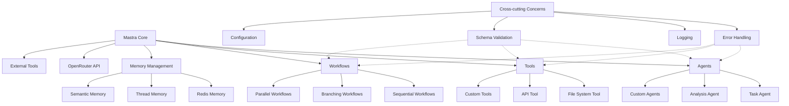
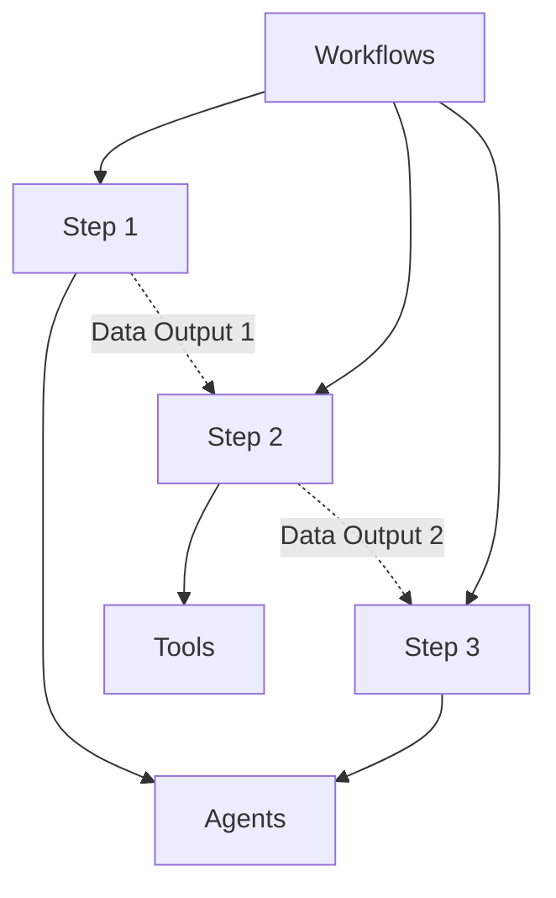
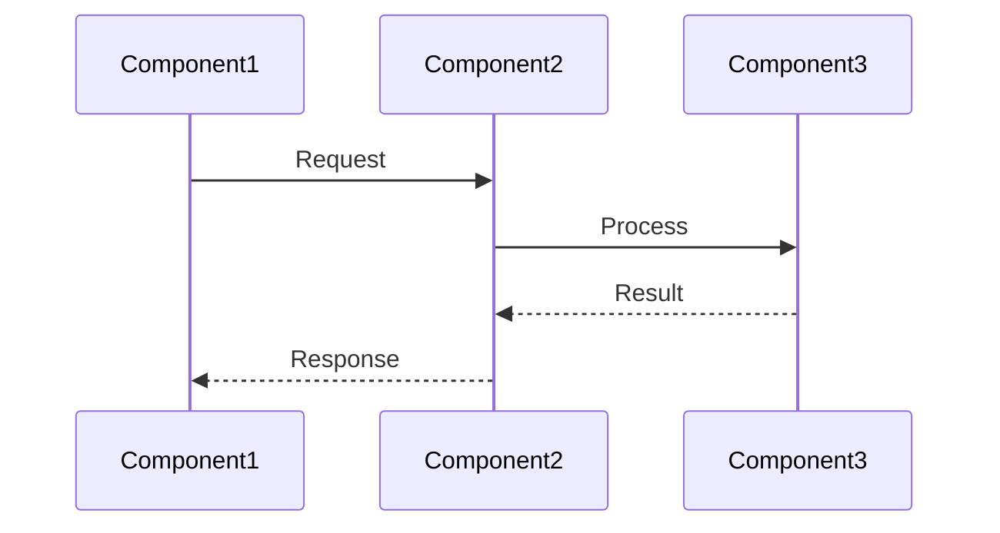
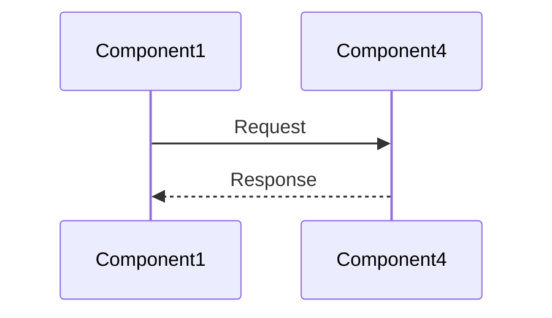
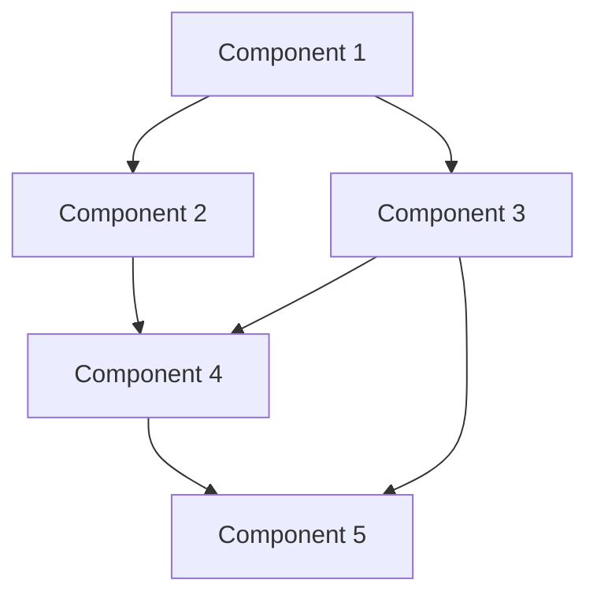

# Component Map

## Purpose
This document provides a map of all components in the system, their relationships, and responsibilities.

## Classification
- **Domain:** Architecture
- **Stability:** Semi-stable
- **Abstraction:** Structural
- **Confidence:** Established

## Content

### Component Overview

The system is composed of the following major components specific to Mastra-based LLM agent projects:

### Workflow Components

Workflow components orchestrate multi-step agent operations using a **relay race data flow model**:

**Key Aspects:**
- Step-based execution model with explicit data passing
- **Critical:** Each step only receives the previous step's output (relay race model)
- Conditional branching support
- Parallel execution capabilities
- Error handling and recovery

**Data Flow Considerations:**
- Steps must explicitly pass data forward using spread operators
- No automatic context accumulation between steps
- See [Workflow Data Flow Patterns](../cross_cutting/mastra_workflow_patterns.md) for critical guidance

### Component Inventory

| Component | Type | Purpose | Key Responsibilities |
|-----------|------|---------|---------------------|
| [Component 1] | [UI/API/Business/Data/etc.] | [Brief purpose] | [Key responsibilities] |
| [Component 2] | [UI/API/Business/Data/etc.] | [Brief purpose] | [Key responsibilities] |
| [Component 3] | [UI/API/Business/Data/etc.] | [Brief purpose] | [Key responsibilities] |
| [Component 4] | [UI/API/Business/Data/etc.] | [Brief purpose] | [Key responsibilities] |
| [Component 5] | [UI/API/Business/Data/etc.] | [Brief purpose] | [Key responsibilities] |

### Component Details

#### [Component 1]

**Purpose**: [Brief description of the component's purpose]

**Responsibilities**:
- [Responsibility 1]
- [Responsibility 2]
- [Responsibility 3]

**Dependencies**:
- **Depends on**: [Components this component depends on]
- **Used by**: [Components that depend on this component]

**Key Interfaces**:
- [Interface 1]: [Description]
- [Interface 2]: [Description]

**Documentation**: [Link to detailed component documentation]

#### [Component 2]

**Purpose**: [Brief description of the component's purpose]

**Responsibilities**:
- [Responsibility 1]
- [Responsibility 2]
- [Responsibility 3]

**Dependencies**:
- **Depends on**: [Components this component depends on]
- **Used by**: [Components that depend on this component]

**Key Interfaces**:
- [Interface 1]: [Description]
- [Interface 2]: [Description]

**Documentation**: [Link to detailed component documentation]

### Component Interaction Patterns

#### [Interaction Pattern 1]

[Description of this interaction pattern]

#### [Interaction Pattern 2]

[Description of this interaction pattern]

### Component Dependencies

### Component Boundaries and Interfaces

[Description of the key boundaries between components and how they interact across these boundaries]

### Component Evolution

[Description of how components are expected to evolve over time, including planned refactorings or replacements]

## Relationships
- **Parent Nodes:** [architecture/system_architecture.md]
- **Child Nodes:** 
  - [Individual component documentation files]
- **Related Nodes:** 
  - [foundation/system_overview.md] - summarizes - High-level system overview
  - [architecture/data_architecture.md] - details - Data flows between components
  - [architecture/integration_patterns.md] - details - How components communicate
  - [architecture/workflow_architecture.md] - details - Workflow relay race architecture
  - [cross_cutting/mastra_workflow_patterns.md] - implementation - Workflow data flow patterns

## Navigation Guidance
- **Access Context:** Use this document when needing to understand the components that make up the system and their relationships
- **Common Next Steps:** After reviewing this component map, typically explore specific components of interest or integration patterns
- **Related Tasks:** System design, component development, integration planning
- **Update Patterns:** This document should be updated when components are added, removed, or their responsibilities change significantly

## Metadata
- **Created:** [Date]
- **Last Updated:** [Date]
- **Updated By:** [Role/Agent]

## Change History
- [Date]: Initial creation of component map
