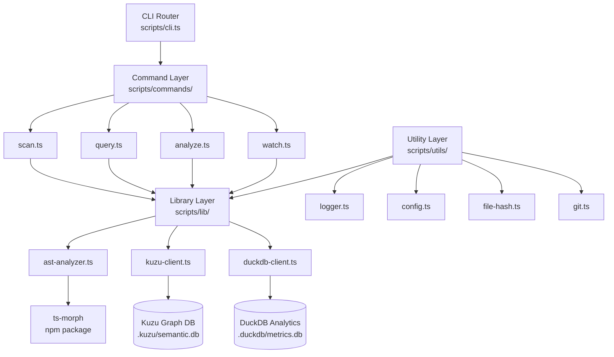

# Tooling Architecture

## Purpose
This document describes the architecture of the TypeScript semantic analysis tooling system, including the Deno-based CLI, database integrations, and analysis engines.

## Classification
- **Domain:** Architecture
- **Stability:** Semi-stable
- **Abstraction:** Structural
- **Confidence:** Established

## Content

### Overview

The tooling architecture implements a semantic analysis system for TypeScript codebases, providing developers and AI agents with deep understanding of code structure, relationships, and metrics through a unified CLI interface.

### Architecture Diagram



### Architectural Layers

#### 1. CLI Layer
**Location**: `scripts/cli.ts`

**Responsibilities**:
- Command registration and routing
- Global option parsing (--json, --verbose, --output)
- Help system and documentation
- Error handling and user feedback

**Technology**: Cliffy command framework

**Key Design Decisions**:
- Uses Cliffy for rich CLI capabilities
- Supports command chaining via exit codes
- JSON output mode for AI agent consumption
- Consistent error reporting across commands

#### 2. Command Layer
**Location**: `scripts/commands/`

**Responsibilities**:
- Implement specific CLI commands
- Validate command-specific options
- Coordinate library modules to fulfill requests
- Format output for display or export

**Commands**:
- `scan.ts` - Extract AST and populate databases
- `query.ts` - Query semantic graph database
- `analyze.ts` - Orchestrate comprehensive analysis
- `watch.ts` - Monitor files and incrementally update
- `doctor.ts` - Health check and validation
- `init.ts` - Database initialization

**Key Design Decisions**:
- Each command is independently testable
- Commands are thin orchestrators, not implementers
- Consistent option patterns across commands
- Support for both interactive and programmatic use

#### 3. Library Layer
**Location**: `scripts/lib/`

**Responsibilities**:
- Core business logic for analysis
- Database client abstractions
- AST parsing and extraction
- Query building and execution

**Modules**:
- `ast-analyzer.ts` - TypeScript AST extraction using ts-morph
- `kuzu-client.ts` - Kuzu graph database client
- `duckdb-client.ts` - DuckDB analytics database client
- `graph-querier.ts` - High-level graph query patterns
- `metrics-collector.ts` - Code metrics calculation

**Key Design Decisions**:
- Pure business logic, no CLI concerns
- Fully unit testable
- Database clients handle connection pooling
- Error recovery at this layer

#### 4. Utility Layer
**Location**: `scripts/utils/`

**Responsibilities**:
- Cross-cutting utilities
- Configuration management
- Logging and debugging
- File system operations

**Modules**:
- `logger.ts` - Structured logging with levels
- `config.ts` - Environment and configuration loading
- `file-hash.ts` - Fast file hashing for change detection
- `git.ts` - Git operations and integration
- `cache.ts` - Query result caching

**Key Design Decisions**:
- No business logic, pure utilities
- Highly reusable across commands
- Consistent interfaces

### Data Flow

#### Scanning Flow
```
TypeScript Files
    ↓
ast-analyzer.ts (ts-morph)
    ↓
Extract Symbols, Types, Relationships
    ↓
kuzu-client.ts → Kuzu DB (graph)
duckdb-client.ts → DuckDB (metrics)
```

#### Query Flow
```
User Query (Natural Language or Cypher)
    ↓
query.ts Command
    ↓
Parse and Translate
    ↓
kuzu-client.ts → Execute Cypher
    ↓
Format Results
    ↓
Output (Table, JSON, or Graph)
```

#### Analysis Flow
```
analyze.ts Command
    ↓
Coordinate Multiple Analyses
    ├→ Query Kuzu (relationships)
    ├→ Query DuckDB (metrics)
    └→ Correlate Results
    ↓
Generate Report
    ↓
Output (Markdown, JSON, or HTML)
```

### Database Architecture

#### Kuzu (Graph Database)
**Purpose**: Store code structure as a property graph

**Schema**:
- **Nodes**: Symbol, Type, Import, Module
- **Relationships**: CALLS, HAS_TYPE, EXTENDS, IMPLEMENTS, MEMBER_OF, IMPORTS

**Access Pattern**: Cypher queries via kuzu-client.ts

**Location**: `.kuzu/semantic.db`

#### DuckDB (Analytics Database)
**Purpose**: Store metrics, statistics, and time-series data

**Schema**:
- `file_metrics` - Per-file statistics
- `symbol_complexity` - Complexity scores
- `type_relationships` - Type usage patterns
- `scan_history` - Historical scan data

**Access Pattern**: SQL queries via duckdb-client.ts

**Location**: `.duckdb/metrics.db`

### Integration Points

#### TypeScript Analysis
- Uses `ts-morph` for AST parsing
- Handles TypeScript-specific semantics
- Resolves types and references
- Extracts JSDoc comments

#### Git Integration
- Track changes via git SHA
- Enable historical queries
- Support git hooks for auto-updates
- Blame integration for authorship

#### AI Agent Integration
- JSON output mode for all commands
- Structured error messages
- Command chaining support
- Context-aware help text

### Extension Points

#### Adding New Commands
1. Create `scripts/commands/new-command.ts`
2. Import and use library modules
3. Register in `scripts/cli.ts`
4. Add tests in `scripts/commands/new-command.test.ts`

#### Adding New Analysis
1. Extend `ast-analyzer.ts` or create new analyzer
2. Add database schema if needed
3. Create query patterns in library layer
4. Expose via command or API

#### Adding New Database
1. Create client in `scripts/lib/`
2. Define schema and migrations
3. Integrate with relevant commands
4. Update health checks

### Performance Considerations

**Scanning Performance**:
- Incremental updates via file hashing
- Parallel file processing where possible
- Efficient AST traversal
- Batch database inserts

**Query Performance**:
- Kuzu graph algorithms optimized
- DuckDB columnar storage fast for analytics
- Query result caching
- Index strategy for common queries

**Watch Mode**:
- Debounced file watching
- Selective re-scanning
- Background processing
- Minimal UI updates

### Security Considerations

**File System Access**:
- Deno permissions explicitly granted
- Respects `.gitignore` patterns
- Safe path handling (no traversal attacks)

**Database Access**:
- Local file-based databases only
- No network exposure
- Query parameterization prevents injection

**AI Agent Safety**:
- Commands validate inputs
- No arbitrary code execution
- Sandboxed analysis (AST only, no eval)

### Error Handling Strategy

**At CLI Layer**:
- User-friendly error messages
- Suggestions for common mistakes
- Help text on invalid usage

**At Command Layer**:
- Validate inputs early
- Provide context in errors
- Graceful degradation

**At Library Layer**:
- Specific error types
- Detailed error information
- Recovery strategies

**At Utility Layer**:
- Robust file operations
- Network retry logic
- Comprehensive logging

### Testing Strategy

**Unit Tests** (scripts/**/*.test.ts):
- Pure functions in library layer
- Utility functions
- Query builders
- Algorithm implementations

**Manual Integration Tests**:
- Full command execution
- Database operations
- File system interactions
- End-to-end workflows

**Validation**:
- `doctor.ts` health check
- Schema validation on init
- Runtime checks in commands

## Relationships
- **Parent Nodes:**
  - [adr_002_deno_node_runtime_split.md] - implements - Built on Deno runtime decision
  - [adr_004_kuzu_duckdb_databases.md] - implements - Uses dual database architecture
- **Child Nodes:**
  - [directory_structure.md] - details - Physical layout of tools
  - [command_reference.md] - details - All available commands
- **Related Nodes:**
  - [../discoveries/locations/semantic-analysis-tools.md] - documents - Key code locations
  - [../cross_cutting/query_patterns.md] - uses - Common query patterns

## Navigation Guidance
- **Access Context:** Reference when designing new tools or understanding the tooling system
- **Common Next Steps:** Explore specific commands or dive into library implementations
- **Related Tasks:** Adding features, debugging tools, performance optimization
- **Update Patterns:** Update when major architectural changes occur

## Metadata
- **Created:** 2025-09-30
- **Last Updated:** 2025-09-30
- **Updated By:** Claude (AI Agent)

## Change History
- 2025-09-30: Initial creation based on implementation guide and existing code