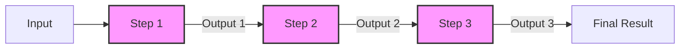

# Mastra Workflow Architecture

## Purpose
This document describes the architectural patterns and principles underlying Mastra workflows, with a focus on the relay race data flow model that is fundamental to successful workflow implementation.

## Classification
- **Domain:** Architecture
- **Stability:** Established
- **Abstraction:** Structural
- **Confidence:** Established
- **Lifecycle Stage:** Active
- **Audience:** Architects, Senior Developers

## Content

### Architectural Overview

Mastra workflows implement a **step-based orchestration pattern** where each step is an isolated execution unit that receives input from the previous step and produces output for the next step. This architecture enforces explicit data flow and prevents implicit state accumulation.



### Core Architectural Principles

#### 1. Isolation of Execution Context

Each workflow step operates in complete isolation:
- No shared memory between steps
- No global state accessible across steps
- Each step receives only what the previous step explicitly returns

This isolation provides:
- **Predictability**: Step behavior depends only on its input
- **Testability**: Steps can be tested independently
- **Composability**: Steps can be reused in different workflows

#### 2. Explicit Data Flow (Relay Race Model)

The relay race model is the fundamental pattern:

```typescript
// Architectural constraint: Each step only sees previous step's output
interface WorkflowStep<TInput, TOutput> {
  execute: (context: { inputData: TInput }) => Promise<TOutput>
}
```

**Key Characteristics:**
- Data must be explicitly passed between steps
- No automatic accumulation of context
- Each step decides what data continues forward

#### 3. Type Safety Through Schemas

Workflows enforce type safety at architectural level:

```typescript
interface WorkflowArchitecture {
  // Schema validation at workflow boundaries
  inputSchema: ZodSchema
  outputSchema: ZodSchema
  
  // Schema validation at step boundaries
  steps: Array<{
    inputSchema: ZodSchema
    outputSchema: ZodSchema
    execute: StepFunction
  }>
}
```

### Workflow Execution Model

#### Sequential Execution

Default execution model processes steps in sequence:

```
[Start] → [Step A] → [Step B] → [Step C] → [End]
         Data A→B    Data B→C    Data C→End
```

**Architectural Guarantees:**
- Steps execute in defined order
- Each step completes before next begins
- Data flows unidirectionally

#### Branching Execution

Conditional workflow paths based on data:

```
                  ┌→ [Step B1] → [Step C1] →┐
[Start] → [Step A]                          → [End]
                  └→ [Step B2] → [Step C2] →┘
```

**Branching Rules:**
- Branch decision based on previous step output
- Only one branch executes
- Branches converge to single output

#### Parallel Execution

Concurrent step execution for performance:

```
                  ┌→ [Step B1] →┐
[Start] → [Step A] → [Step B2] → [Step C] → [End]
                  └→ [Step B3] →┘
```

**Parallel Constraints:**
- Parallel steps receive same input
- All parallel steps must complete
- Results merge for next step

### Data Flow Patterns

#### Pattern 1: Accumulator Anti-Pattern (What NOT to Do)

```typescript
// ❌ ANTI-PATTERN: Expecting automatic accumulation
// This violates the architectural model
const workflow = {
  step1: () => ({ a: 1 }),
  step2: () => ({ b: 2 }), // Expects 'a' to be available
  step3: (data) => {
    // Expects both 'a' and 'b' - WILL FAIL
    return data.a + data.b;
  }
}
```

#### Pattern 2: Explicit Relay Pattern (Correct)

```typescript
// ✅ CORRECT: Explicit data passing
const workflow = {
  step1: () => ({ a: 1 }),
  step2: ({ inputData }) => ({ ...inputData, b: 2 }),
  step3: ({ inputData }) => {
    // Has both 'a' and 'b' from explicit passing
    return { sum: inputData.a + inputData.b };
  }
}
```

### Memory and State Management

#### Workflow-Level State

Workflows are stateless by design:
- No workflow-level variables
- No shared state between executions
- Each execution is independent

#### Step-Level State

Steps should be pure functions:
- No side effects on external state
- Deterministic output for given input
- State changes through explicit returns

#### External State Interaction

When external state is necessary:
- Use tools for database/API access
- Treat as explicit I/O operations
- Document state dependencies

### Error Handling Architecture

#### Step-Level Error Handling

```typescript
interface StepErrorHandling {
  retry?: {
    attempts: number
    delay: number
    backoff: 'linear' | 'exponential'
  }
  fallback?: StepFunction
  errorHandler?: (error: Error) => StepOutput
}
```

#### Workflow-Level Error Handling

- Errors propagate up the execution chain
- Workflows can define global error handlers
- Failed workflows maintain execution history

### Performance Considerations

#### Data Transfer Overhead

Since each step passes data explicitly:
- Large datasets increase serialization cost
- Consider passing references for large data
- Use selective passing for optimization

#### Step Granularity

Balance between:
- **Fine-grained steps**: Better reusability, more overhead
- **Coarse-grained steps**: Less overhead, reduced reusability

### Testing Architecture

#### Unit Testing Steps

Steps are independently testable:
```typescript
describe('Step', () => {
  it('transforms input correctly', async () => {
    const input = { data: 'test' };
    const output = await step.execute({ inputData: input });
    expect(output).toMatchObject({ 
      ...input, 
      processed: true 
    });
  });
});
```

#### Integration Testing Workflows

Test complete data flow:
```typescript
describe('Workflow', () => {
  it('maintains data through execution', async () => {
    const result = await workflow.run({ initial: 'data' });
    expect(result).toHaveProperty('initial', 'data');
    expect(result).toHaveProperty('processed');
  });
});
```

### Best Practices for Architects

#### 1. Design Data Flow First

Before implementation:
- Map complete data journey
- Identify what each step needs/produces
- Document data transformations

#### 2. Enforce Schema Contracts

- Define schemas for all step boundaries
- Use TypeScript types for compile-time safety
- Validate at runtime with Zod schemas

#### 3. Minimize Step Dependencies

- Keep steps focused on single responsibilities
- Avoid steps that need many fields
- Consider step composition for complex operations

#### 4. Plan for Debugging

- Include data flow logging
- Add step execution timestamps
- Maintain execution history

### Common Architectural Decisions

#### Decision: Relay Race vs Accumulator Model

**Context:** How should data flow between workflow steps?

**Decision:** Relay Race Model - each step explicitly passes data

**Rationale:**
- Predictable data flow
- Easier debugging
- Better testability
- Prevents hidden dependencies

**Consequences:**
- Developers must explicitly manage data flow
- More verbose but more maintainable
- Clear data lineage

#### Decision: Schema Validation Points

**Context:** Where should data validation occur?

**Decision:** Validate at every step boundary

**Rationale:**
- Early error detection
- Clear contract enforcement
- Better development experience

**Consequences:**
- Slight performance overhead
- More schema definitions required
- Stronger type safety

## Relationships
- **Parent Nodes:** [architecture/system_architecture.md]
- **Child Nodes:** None
- **Related Nodes:**
  - [cross_cutting/mastra_workflow_patterns.md] - implementation - Practical patterns for this architecture
  - [architecture/component_map.md] - includes - Workflow components in system
  - [decisions/adr_001_workflow_data_passing_strategy.md] - documents - Architectural decision rationale

## Navigation Guidance
- **Access Context:** Reference when designing workflow systems or understanding workflow behavior
- **Common Next Steps:** Review practical patterns or specific implementation examples
- **Related Tasks:** Workflow design, system architecture, performance optimization
- **Update Patterns:** Update when architectural patterns evolve or new patterns emerge

## Metadata
- **Created:** 2025-08-05
- **Last Updated:** 2025-08-05
- **Updated By:** Claude
- **Sources:** Mastra framework documentation, Production experience analysis

## Change History
- 2025-08-05: Initial creation documenting relay race architecture pattern