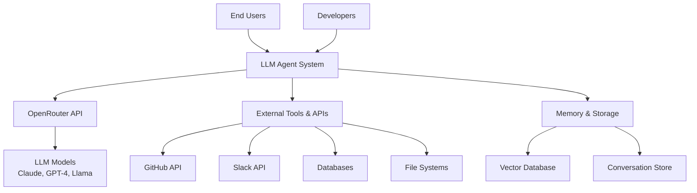
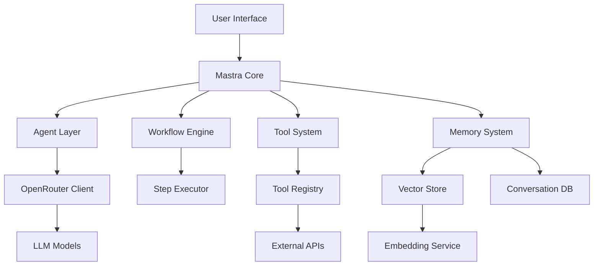
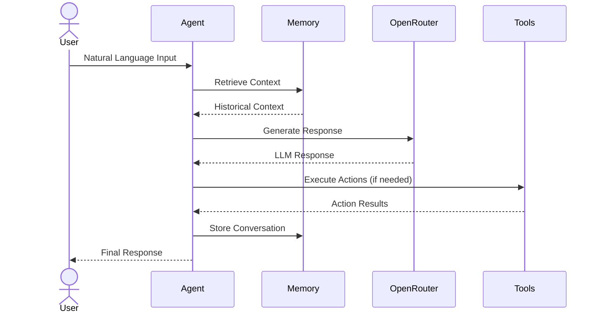
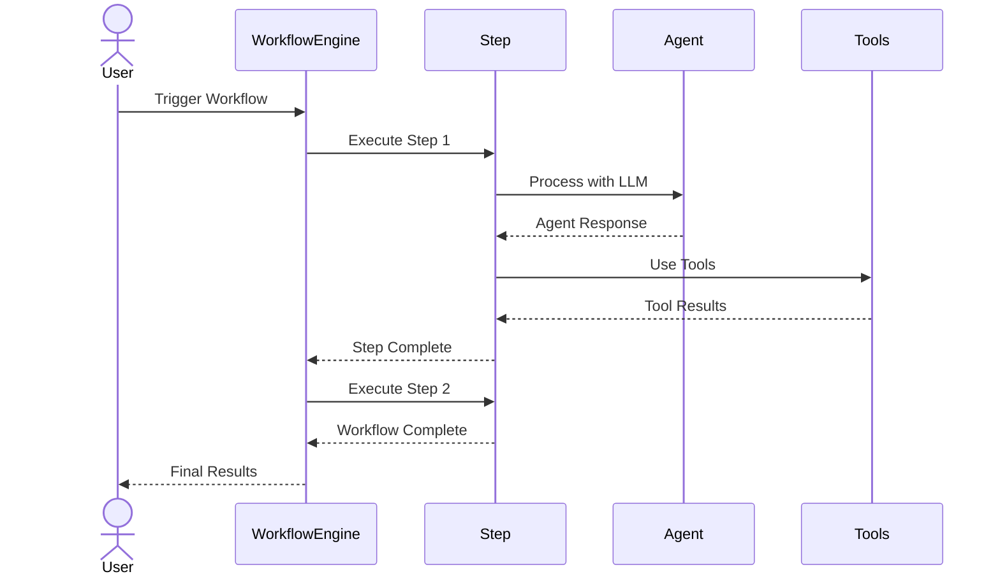
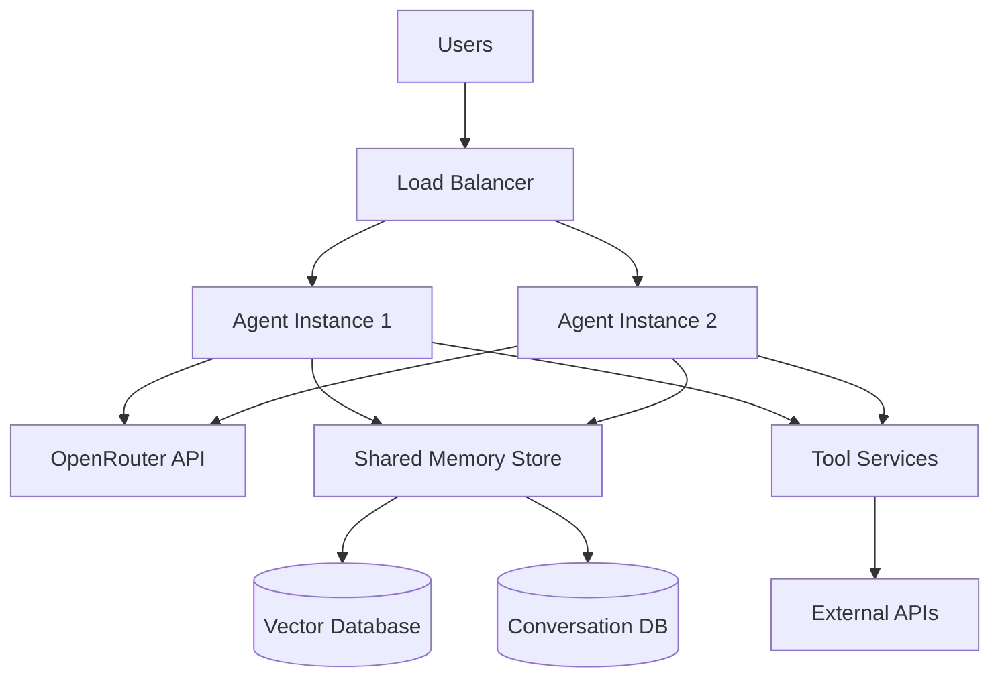

# System Overview

## Purpose
This document provides a high-level overview of the TypeScript LLM Agent system built with Mastra framework and OpenRouter, its purpose, key components, and how they work together.

## Classification
- **Domain:** Foundation
- **Stability:** Semi-stable
- **Abstraction:** Conceptual
- **Confidence:** Established

## Content

### System Purpose and Vision

The TypeScript LLM Agent system is designed to enable rapid development and deployment of intelligent agents that can perform complex tasks through natural language interaction, tool usage, and workflow orchestration. The system leverages the Mastra framework for agent architecture and OpenRouter for LLM model access, providing a robust foundation for building sophisticated AI-powered applications.

**Core Problems Solved:**
- Complex task automation through intelligent agents
- Natural language interfaces for business processes
- Integration of multiple tools and services through AI orchestration
- Scalable workflow management with human-AI collaboration

**Primary Users:**
- Developers building intelligent automation systems
- Product teams requiring AI-powered features
- Operations teams automating complex workflows
- End users interacting with AI agents for task completion

### System Context

The system operates within a broader ecosystem of LLM providers, external APIs, and business systems, serving as an intelligent orchestration layer that bridges human intent with automated execution.

### Key Capabilities

The system provides comprehensive capabilities for building and operating intelligent agents:

1. **Intelligent Conversation Management**
   Natural language processing and response generation with context awareness and memory persistence

2. **Dynamic Tool Orchestration**
   Automatic selection and execution of appropriate tools based on user intent and task requirements

3. **Workflow Automation**
   Step-based execution of complex processes with conditional branching, parallel execution, and error handling

4. **Multi-Modal Integration**
   Support for text, code, file processing, and API interactions within unified agent workflows

5. **Memory and Context Management**
   Persistent conversation history, semantic search, and context-aware decision making

6. **Model Provider Abstraction**
   Seamless integration with multiple LLM models through OpenRouter with automatic fallback and optimization

### High-Level Architecture

The system follows Mastra's modular architecture with clear separation of concerns and pluggable components:

#### Key Components

The system is built around Mastra's core architectural components:

1. **Mastra Core**
   Central orchestration hub managing dependency injection, configuration, and component lifecycle

2. **Agent Layer**
   Primary abstraction for AI interactions, handling instructions, model communication, and response processing

3. **Workflow Engine**
   Step-based execution system supporting complex processes with branching, looping, and parallel execution

4. **Tool System**
   Dynamic tool composition and execution framework enabling agents to interact with external systems

5. **Memory System**
   Conversation persistence and semantic recall capabilities for context-aware interactions

6. **OpenRouter Integration**
   Model provider abstraction layer handling authentication, rate limiting, and model selection

### Key Workflows

The system supports several primary interaction patterns:

#### Agent Conversation Workflow

#### Workflow Execution Process

### Technology Stack

The system leverages modern TypeScript and AI technologies:

| Layer | Technologies | Justification |
|-------|--------------|---------------|
| Agent Framework | Mastra | Specialized for LLM agent development with modular architecture |
| Language | TypeScript | Type safety, excellent tooling, and Node.js ecosystem |
| LLM Provider | OpenRouter | Access to multiple models with unified API and cost optimization |
| Models | Claude, GPT-4, Llama | Best-in-class capabilities for different use cases |
| Memory | Vector Databases, JSON Storage | Semantic search and conversation persistence |
| Tools | REST APIs, File Systems, Databases | Comprehensive external system integration |
| Deployment | Node.js, Docker, Cloud Platforms | Scalable and maintainable deployment options |

#### Reference Documentation
Comprehensive Mastra framework documentation is available locally at `/workspaces/mastra-context-network/reference/mastra-docs/`. See [foundation/reference_resources.md] for detailed documentation structure and usage guidelines.

### Deployment Model

The system supports flexible deployment patterns from development to production:

### Quality Attributes

#### Performance
- Sub-second response times for simple queries
- Efficient token usage optimization
- Parallel tool execution capabilities
- Caching strategies for repeated operations

#### Scalability
- Horizontal scaling through stateless agent instances
- Shared memory architecture for multi-instance deployments
- Rate limiting and queue management for high-volume scenarios
- Cost optimization through intelligent model selection

#### Security
- API key management and rotation
- Input sanitization and prompt injection protection
- Audit logging for all agent interactions
- Role-based access control for sensitive operations

#### Reliability
- Automatic retry mechanisms for LLM failures
- Graceful degradation when external services are unavailable
- Circuit breaker patterns for external API calls
- Comprehensive error handling and recovery

#### Maintainability
- Clear separation between agent logic and infrastructure
- Comprehensive logging and monitoring
- Version-controlled agent configurations
- Automated testing for agent behaviors

### Future Evolution

The system is designed to evolve with the rapidly advancing LLM and agent ecosystem:

- **Enhanced Model Integration**: Support for new LLM providers and specialized models
- **Advanced Workflow Capabilities**: More sophisticated orchestration patterns and conditional logic
- **Improved Memory Systems**: Better semantic search and long-term memory management
- **Multi-Agent Coordination**: Support for agent-to-agent communication and collaboration
- **Performance Optimization**: Caching, streaming, and efficiency improvements
- **Security Enhancements**: Advanced prompt security and data protection measures

## Relationships
- **Parent Nodes:** [foundation/project_definition.md]
- **Child Nodes:** 
  - [architecture/agent_architecture.md] - details - Detailed agent architecture patterns
  - [architecture/component_map.md] - details - Mastra component relationships
- **Related Nodes:** 
  - [foundation/agent_concepts.md] - implements - Core agent domain concepts
  - [foundation/reference_resources.md] - references - Official Mastra documentation
  - [cross_cutting/mastra_integration_guide.md] - uses - Mastra framework integration
  - [cross_cutting/openrouter_configuration_guide.md] - uses - OpenRouter model provider setup

## Navigation Guidance
- **Access Context:** Use this document when needing a high-level understanding of the LLM agent system
- **Common Next Steps:** After reviewing this overview, typically explore agent architecture, Mastra integration guide, or specific agent components
- **Related Tasks:** Agent system introduction, onboarding, high-level agent planning, architecture decisions
- **Update Patterns:** This document should be updated when there are significant changes to agent capabilities, Mastra framework updates, or OpenRouter integration changes

## Metadata
- **Created:** [Date]
- **Last Updated:** [Date]
- **Updated By:** [Role/Agent]

## Change History
- 2025-06-30: Transformed to focus on TypeScript LLM Agent system with Mastra and OpenRouter
- [Date]: Initial creation of system overview
