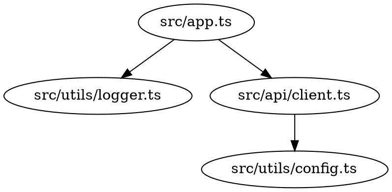

# First Sprint Guide

**Goal:** Get familiar with the template and complete your first custom feature in 1-2 weeks.

## Week 1: Setup & Understanding

### Day 1: Environment Setup

**Tasks:**
1. Install prerequisites (Deno, Kuzu, DuckDB)
2. Run `deno task db:init` to create databases
3. Run `deno task scan` on this template code
4. Verify databases populated successfully

**Success Criteria:**
- Both databases initialized
- Initial scan completes without errors
- You can query: `deno task query "show classes"`

**Common Issues:**
- **Kuzu not found**: Check installation, add to PATH
- **Perm Denied**: Run with `--allow-all` or check file permissions
- **Scan fails**: Check TypeScript compiler options in scan.ts

---

### Day 2-3: Explore Query System

**Tasks:**
1. Try all natural language patterns (see `--nl-help`)
2. Experiment with query templates (see `--templates`)
3. Write 3-5 raw Cypher queries
4. Test different output formats (table, json, tree)

**Exercises:**
```bash
# 1. Find all functions
deno task query "show symbols" # Try to write this as Cypher

# 2. Find circular dependencies (if any)
# Hint: Use MATCH with path patterns

# 3. Find the most complex files
# Hint: Query DuckDB metrics via raw SQL (different from Cypher!)
```

**Success Criteria:**
- Comfortable with 5+ query patterns
- Understand difference between Kuzu (graph) and DuckDB (analytics)
- Can write basic Cypher queries

---

### Day 4-5: Watch System

**Tasks:**
1. Start watch mode: `deno task watch --verbose`
2. Edit a file, observe auto-rescan
3. Add a new file, verify it's detected
4. Delete a file, check database cleanup
5. Stop and restart watch - verify state persists

**Exercises:**
```bash
# Terminal 1
deno task watch

# Terminal 2 - make changes, then query:
deno task query "symbols in [file-you-changed]"
```

**Success Criteria:**
- Understand hash-based change detection
- Comfortable with watch workflow
- Know when to use watch vs manual scan

---

### Bonus: Mastra Framework Exploration (Optional)

**If you're working with Mastra projects, add these exercises:**

**Tasks:**
1. Scan a Mastra codebase (or create a sample agent/workflow)
2. Try all Mastra-specific query patterns
3. Understand how Mastra components map to TypeScript analysis

**Exercises:**
```bash
# 1. Discover all Mastra components
deno task query "show all agents"
deno task query "show all workflows"
deno task query "show all tools"
deno task query "show integrations"

# 2. Analyze agent structure
deno task query "symbols in src/agents/[your-agent].ts"
deno task query "agent tools in src/agents/[your-agent].ts"
deno task query "dependencies of src/agents/[your-agent].ts"

# 3. Analyze workflow structure
deno task query "workflow steps in src/workflows/[your-workflow].ts"
deno task query "call graph of [workflow-step] depth 2"

# 4. Find model and LLM usage
deno task query "show models"
deno task query "llm providers"
deno task query "who imports openai"

# 5. Development workflow
# Terminal 1:
deno task watch --path src/agents

# Terminal 2 - create new agent, then:
deno task query "symbols in src/agents/new-agent.ts"
deno task query "who calls newAgent"
```

**Mastra-Specific Success Criteria:**
- Can find all agents, workflows, and tools in a codebase
- Understand agent dependencies and tool usage
- Can trace workflow execution
- Know how to find LLM provider usage

**See [Mastra Development Guide](mastra-guide.md) for comprehensive workflows.**

---

## Week 2: First Custom Feature

Choose **ONE** of these features based on your needs:

### Option A: Custom Query Pattern (Easiest)

**Add a query for "dead code" (functions never called)**

1. Add template in `scripts/lib/query-builder.ts`:
```typescript
static findDeadCode(): QueryBuilder {
  return new QueryBuilder()
    .match("(s:Symbol)")
    .where("s.kind = 'function'")
    .where("NOT exists((caller:Symbol)-[:CALLS]->(s))")
    .where("s.exported = false")
    .return("s.name AS dead_function", "s.file AS file", "s.line AS line")
    .orderBy("s.file");
}
```

2. Add NL pattern in `scripts/lib/natural-language-parser.ts`:
```typescript
if (this.matchPattern(normalized, ["dead code", "unused functions", "never called"])) {
  return {
    builder: QueryTemplates.findDeadCode(),
    pattern: "find-dead-code",
    confidence: 0.95,
  };
}
```

3. Test:
```bash
deno task query "dead code"
deno task query -t find-dead-code
```

**Time:** 1-2 hours

---

### Option B: Complexity Analysis (Medium)

**Add command to show top N most complex files**

1. Create `scripts/commands/complexity.ts`:
```typescript
export const complexityCommand = new Command()
  .name("complexity")
  .description("Analyze code complexity")
  .option("-n, --top <count:number>", "Top N files", { default: 10 })
  .option("--threshold <value:number>", "Min complexity to show")
  .action(async (options) => {
    await duckdbClient.initialize();

    // Query top complex files
    const sql = `
      SELECT file_path, complexity_sum, total_lines, function_count
      FROM file_metrics
      WHERE complexity_sum > ${options.threshold || 0}
      ORDER BY complexity_sum DESC
      LIMIT ${options.top}
    `;

    const result = await duckdbClient.query(sql);

    // Format and display
    const table = new Table()
      .header(["File", "Complexity", "Lines", "Functions"])
      .body(result.rows.map(r => [
        r.file_path,
        r.complexity_sum,
        r.total_lines,
        r.function_count
      ]));

    table.render();
  });
```

2. Register in `scripts/cli.ts`

3. Test:
```bash
deno task complexity --top 5
deno task complexity --threshold 50
```

**Time:** 2-4 hours

---

### Option C: Dependency Graph Export (Advanced)

**Export dependency graph in DOT format for Graphviz**

1. Create `scripts/commands/export-graph.ts`
2. Query all imports/dependencies from Kuzu
3. Generate DOT format output
4. Add options for filtering (e.g., only specific directories)

Example output:


5. Visualize:
```bash
deno task export-graph > deps.dot
dot -Tpng deps.dot -o deps.png
open deps.png
```

**Time:** 4-8 hours

---

### Option D: Mastra Agent Discovery Dashboard (Mastra-Specific)

**Create a command that shows comprehensive Mastra project overview**

1. Create `scripts/commands/mastra-overview.ts`:
```typescript
export const mastraOverviewCommand = new Command()
  .name("mastra-overview")
  .description("Show comprehensive Mastra project overview")
  .option("--json", "Output as JSON")
  .action(async (options) => {
    await kuzuClient.initialize();

    // Query agents
    const agents = await kuzuClient.query(
      "MATCH (s:Symbol) WHERE s.name = 'createAgent' RETURN s.file, s.line"
    );

    // Query workflows
    const workflows = await kuzuClient.query(
      "MATCH (s:Symbol) WHERE s.name = 'createWorkflow' RETURN s.file, s.line"
    );

    // Query tools
    const tools = await kuzuClient.query(
      "MATCH (s:Symbol) WHERE s.name = 'createTool' RETURN s.file, s.line"
    );

    // Query integrations
    const integrations = await kuzuClient.query(
      "MATCH (i:Import) WHERE i.imported_path CONTAINS '@mastra/' RETURN DISTINCT i.imported_path"
    );

    if (options.json) {
      console.log(JSON.stringify({
        agents: agents.rows,
        workflows: workflows.rows,
        tools: tools.rows,
        integrations: integrations.rows
      }, null, 2));
    } else {
      console.log("=== Mastra Project Overview ===\n");
      console.log(`Agents: ${agents.rows.length}`);
      console.log(`Workflows: ${workflows.rows.length}`);
      console.log(`Tools: ${tools.rows.length}`);
      console.log(`Integrations: ${integrations.rows.length}\n`);

      console.log("Agents:");
      agents.rows.forEach(r => console.log(`  - ${r.file}:${r.line}`));

      console.log("\nWorkflows:");
      workflows.rows.forEach(r => console.log(`  - ${r.file}:${r.line}`));

      console.log("\nTools:");
      tools.rows.forEach(r => console.log(`  - ${r.file}:${r.line}`));

      console.log("\nIntegrations:");
      integrations.rows.forEach(r => console.log(`  - ${r.imported_path}`));
    }
  });
```

2. Register in `scripts/cli.ts`

3. Test:
```bash
deno task mastra-overview
deno task mastra-overview --json
```

**Bonus:** Add LLM provider detection and agent-tool relationship mapping.

**Time:** 3-5 hours

---

## Success Checklist

By end of Week 2, you should be able to:

- [ ] Scan any TypeScript codebase
- [ ] Write custom Cypher queries
- [ ] Add new query patterns/templates
- [ ] Use watch mode confidently
- [ ] Understand Kuzu vs DuckDB use cases
- [ ] Have implemented at least ONE custom feature
- [ ] Know where to look for extending the system

---

## Next Steps

After completing your first sprint:

1. **Review the backlog** (`context-network/planning/typescript-agent-backlog.md`)
2. **Pick Phase 4, 5, or 6** based on your project needs
3. **Document your learnings** in the context network
4. **Consider contributing** patterns back to the template

---

## Getting Help

**Common Patterns:**
- Query patterns: `deno task query --nl-help`
- Templates: `deno task query --templates`
- Architecture: `context-network/discovery.md`

**Debugging:**
- Use `--verbose` flags to see what's happening
- Check database initialization: `ls -la .kuzu .duckdb`
- Test databases directly: `kuzu .kuzu/semantic.db` or `duckdb .duckdb/metrics.db`

**Resources:**
- Cypher tutorial: https://neo4j.com/docs/cypher-manual/
- Kuzu docs: https://kuzudb.com/docs/
- DuckDB docs: https://duckdb.org/docs/

---

Good luck with your first sprint! 🚀
