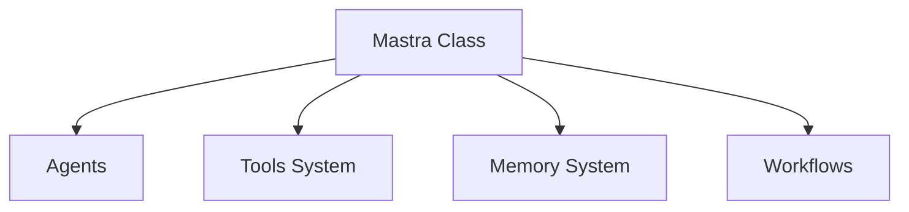
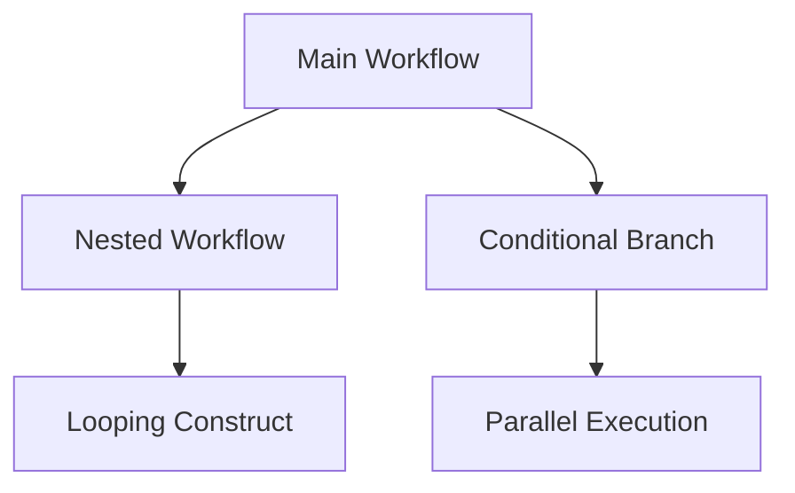
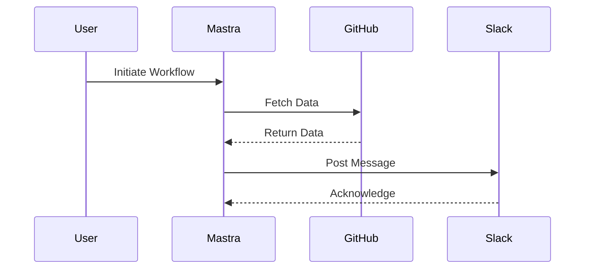
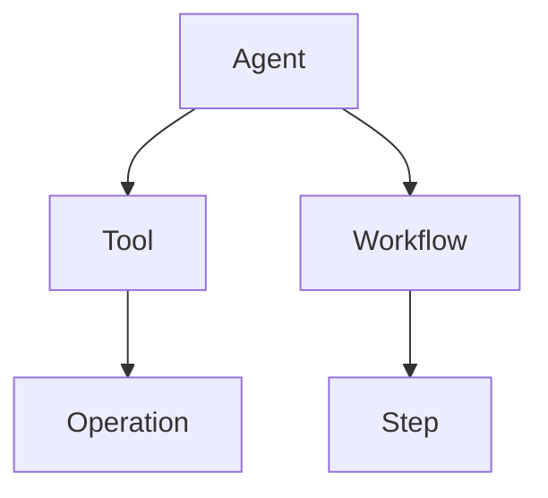
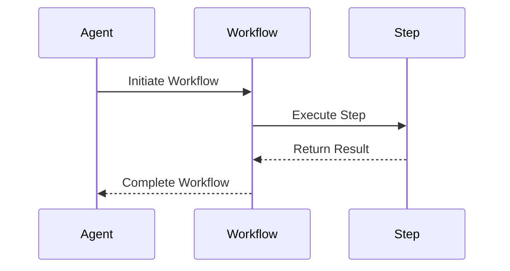
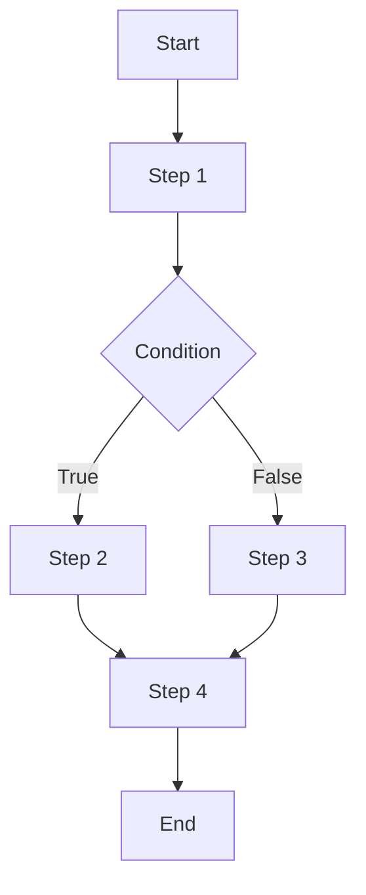
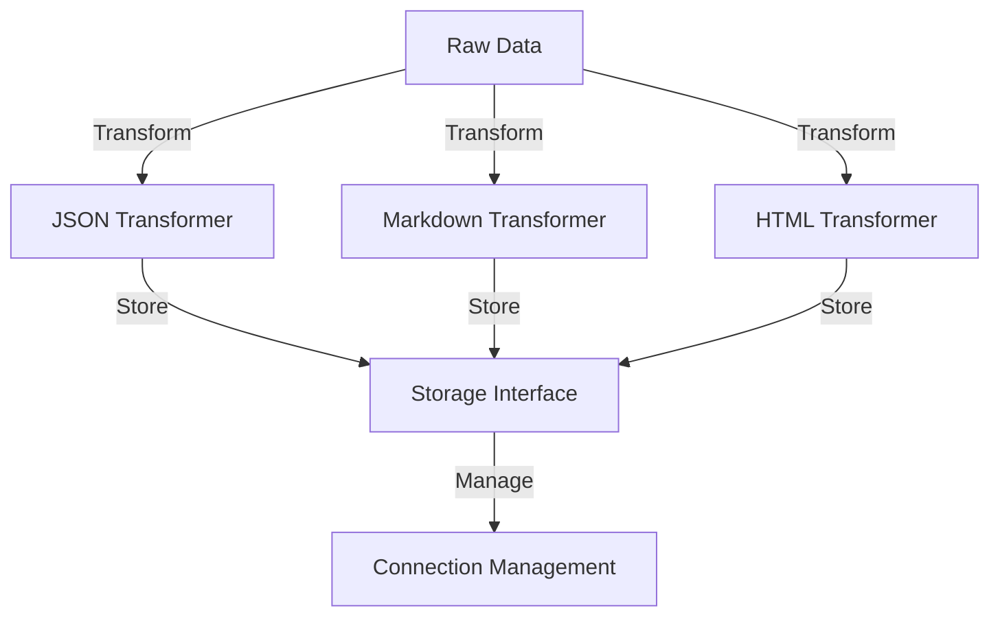
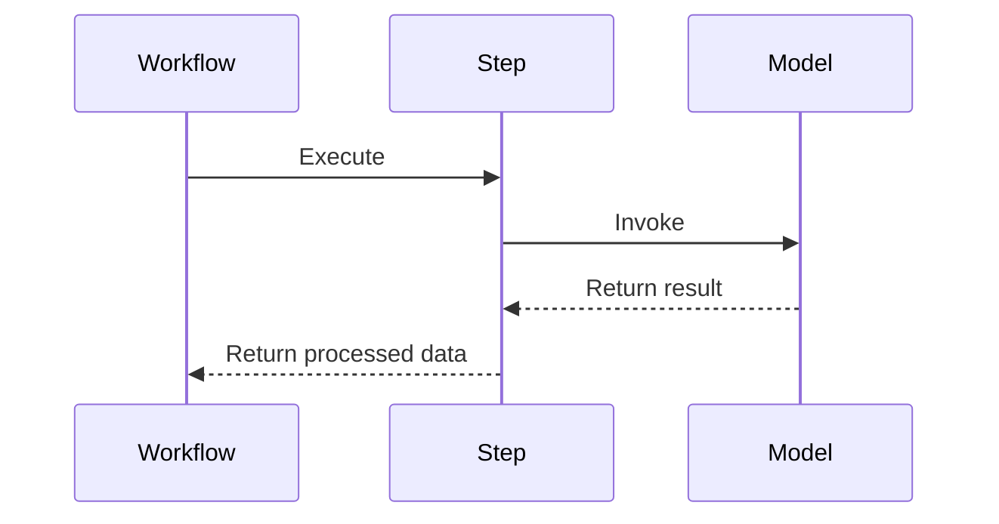
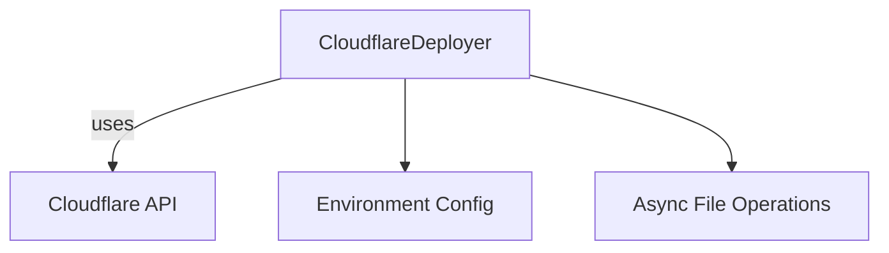
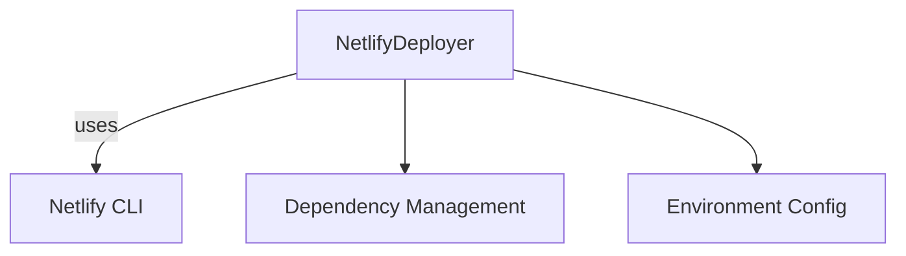

# Wiki Documentation for https://github.com/mastra-ai/mastra

Generated on: 2025-06-30 00:40:22

## Table of Contents

- [Project Overview](#page-1)
- [Architecture Overview](#page-2)
- [Key Features](#page-3)
- [Agents and Tools](#page-4)
- [Workflows](#page-5)
- [Data Management](#page-6)
- [Model Integration](#page-7)
- [Deployment and Infrastructure](#page-8)

<a id='page-1'></a>

## Project Overview

### Related Pages

Related topics: [Architecture Overview](#page-2), [Key Features](#page-3)

<details>
<summary>Relevant source files</summary>

The following files were used as context for generating this wiki page:

- [CLAUDE.md](CLAUDE.md)
- [examples/dane/src/mastra/workflows/changelog.ts](examples/dane/src/mastra/workflows/changelog.ts)
- [packages/core/src/workflows/README.md](packages/core/src/workflows/README.md)
- [examples/dane/src/mastra/workflows/first-contributor.ts](examples/dane/src/mastra/workflows/first-contributor.ts)
- [examples/openapi-spec-writer/src/mastra/workflows/index.ts](examples/openapi-spec-writer/src/mastra/workflows/index.ts)
</details>

# Project Overview

## Introduction

The Mastra project is a modular AI framework designed to facilitate the development and deployment of AI agents. The framework is built around a central orchestration system with pluggable components, allowing for a high degree of flexibility and extensibility. Mastra supports various AI interaction models, including tools, memory, and voice systems, enabling developers to create sophisticated AI applications. This overview will provide a detailed examination of the project's architecture, workflows, and development guidelines, offering insights into how Mastra integrates various components to deliver its functionality.

## Architecture Overview

### Core Components

The Mastra framework is composed of several key components that work together to provide a robust AI development platform:

- **Mastra Class**: This is the central configuration hub located in `packages/core/src/mastra/`. It uses dependency injection to manage and configure different components within the framework.
- **Agents**: Found in `packages/core/src/agent/`, agents are the primary abstraction for AI interactions, handling tools, memory, and voice functionalities.
- **Tools System**: Located in `packages/core/src/tools/`, this system supports dynamic tool composition from multiple sources.
- **Memory System**: This component, in `packages/core/src/memory/`, manages conversation persistence with thread-based and semantic recall capabilities.
- **Workflows**: Found in `packages/core/src/workflows/`, workflows allow for step-based execution with the ability to suspend and resume operations.
- **Storage Layer**: This layer, in `packages/core/src/storage/`, provides pluggable backends with standardized interfaces.

Sources: [CLAUDE.md](), [packages/core/src/workflows/README.md]()

### Workflow System

Mastra's workflow system is a critical component that enables the orchestration of tasks and processes. The system is designed to be flexible, supporting both synchronous and asynchronous operations. Workflows are defined using a series of steps, each with input and output schemas to ensure type safety and consistency.

#### Workflow Example

```typescript
const weatherWorkflow = createWorkflow({
  steps: [fetchWeather, planActivities],
  id: 'weather-workflow-step1-single-day',
  inputSchema: z.object({
    city: z.string().describe('The city to get the weather for'),
  }),
  outputSchema: z.object({
    activities: z.string(),
  }),
})
  .then(fetchWeather)
  .then(planActivities);

weatherWorkflow.commit();
```

Sources: [packages/core/src/workflows/README.md]()

### Workflow Improvements

Recent improvements to the workflow system have addressed several limitations of the original architecture. Key enhancements include:

- **Streamlined Control Flow**: Nested workflows are now a primary construct, allowing for more straightforward composition of complex workflows.
- **Conditional Branching**: The `.branch()` method replaces if/else constructs, enabling clearer conditional paths that execute in parallel.
- **Better Type Safety**: All steps require defined input and output schemas, improving the reliability and predictability of workflows.

Sources: [packages/core/src/workflows/README.md]()

## Tools and Integrations

Mastra supports a wide range of tools and integrations, allowing developers to extend the framework's capabilities. Tools are dynamically composed and can be sourced from various places, including memory and external toolsets.

### Integration Example

```typescript
const getPullRequest = new Step({
  id: 'getPullRequest',
  outputSchema: z.object({
    title: z.string(),
    body: z.string(),
    diff: z.string(),
  }),
  execute: async ({ context }) => {
    const client = await github.getApiClient();
    const pullRequest = await client.pullsGet({
      path: {
        owner: context?.triggerData?.owner,
        repo: context?.triggerData?.repo,
        pull_number: context?.triggerData?.pr_number,
      },
    });
    // Additional logic...
  },
});
```

Sources: [examples/dane/src/mastra/workflows/first-contributor.ts]()

## Development Guidelines

Mastra's development process is guided by a set of best practices to ensure consistency and quality across the project. Key guidelines include:

- **Monorepo Management**: The project uses pnpm for package management and turbo.json for build dependencies. All packages are written in TypeScript with strict type checking.
- **Component Development**: Components should integrate with the central Mastra orchestration and follow plugin patterns for extensibility.
- **Testing Strategy**: Integration tests require Docker services, and Vitest is used as the testing framework.

Sources: [CLAUDE.md]()

## Conclusion

The Mastra project provides a comprehensive framework for developing AI agents, leveraging a modular architecture and a robust workflow system. Its design emphasizes flexibility, extensibility, and type safety, making it a powerful tool for building sophisticated AI applications. By following the provided development guidelines, contributors can ensure the continued growth and improvement of the project.

---

<a id='page-2'></a>

## Architecture Overview

### Related Pages

Related topics: [Agents and Tools](#page-4), [Workflows](#page-5)

<details>
<summary>Relevant source files</summary>

- [CLAUDE.md](CLAUDE.md)
- [examples/dane/src/mastra/workflows/changelog.ts](examples/dane/src/mastra/workflows/changelog.ts)
- [packages/core/src/workflows/README.md](packages/core/src/workflows/README.md)
- [examples/dane/src/mastra/workflows/first-contributor.ts](examples/dane/src/mastra/workflows/first-contributor.ts)
- [examples/openapi-spec-writer/src/mastra/workflows/index.ts](examples/openapi-spec-writer/src/mastra/workflows/index.ts)
</details>

# Architecture Overview

## Introduction

The Mastra framework is a modular AI system designed to facilitate the development and orchestration of AI agents. It is built around a central orchestration mechanism with pluggable components, allowing for flexibility and scalability. The architecture supports various functionalities such as workflow management, integration with third-party services, and extensible toolsets. This overview provides insight into the core components and design patterns that constitute the Mastra architecture.

## Core Components

### Mastra Class

The Mastra Class acts as the central configuration hub, leveraging dependency injection to manage and orchestrate various components within the framework. It ensures that components such as agents, tools, and workflows can be seamlessly integrated and interact with each other efficiently. Sources: [CLAUDE.md]()

### Agents

Agents are the primary abstraction for AI interactions within the Mastra framework. They handle tasks related to memory, tools, and voice processing, acting as the interface between the user and the underlying AI models. Sources: [CLAUDE.md]()

### Tools System

The Tools System supports dynamic composition of tools from multiple sources, allowing for flexible integration of functionalities like data retrieval, processing, and communication. This system is crucial for enabling the framework to interact with external services and APIs. Sources: [CLAUDE.md]()

### Memory System

The Memory System is designed to maintain thread-based conversation persistence with semantic recall capabilities. It allows the framework to retain context across interactions, improving the relevance and coherence of AI responses. Sources: [CLAUDE.md]()

### Workflows

Workflows in Mastra are structured as step-based executions with capabilities for suspension and resumption. They are integral to managing complex processes, allowing for conditional branching and parallel execution. The workflow system is designed to be extensible, supporting integration with external workflow engines. Sources: [packages/core/src/workflows/README.md]()


Sources: [CLAUDE.md](), [packages/core/src/workflows/README.md]()

## Workflow Management

### Streamlined Control Flow

The workflow management system in Mastra supports nested workflows, looping constructs, and branching mechanisms. These features allow developers to define complex workflows with clear and manageable control flows. The system uses `.branch()` for conditional paths and `.parallel()` for concurrent execution, enhancing the flexibility of workflow design. Sources: [packages/core/src/workflows/README.md]()


Sources: [packages/core/src/workflows/README.md]()

## Integration and Extensibility

### Plugin Architecture

Mastra's architecture supports a plugin model, allowing developers to extend its capabilities by integrating custom tools, storage solutions, and external services. This extensibility is achieved through standardized interfaces and dependency injection. Sources: [CLAUDE.md]()

### External Integrations

The framework provides built-in support for integrating with external services such as GitHub and Slack. These integrations are facilitated through tools that can fetch data, post messages, and automate workflows. Sources: [examples/dane/src/mastra/workflows/changelog.ts](), [examples/dane/src/mastra/workflows/first-contributor.ts]()


Sources: [examples/dane/src/mastra/workflows/changelog.ts](), [examples/dane/src/mastra/workflows/first-contributor.ts]()

## Conclusion

The Mastra framework is designed to provide a robust and flexible platform for AI agent development. Its modular architecture, combined with powerful workflow management and integration capabilities, makes it suitable for a wide range of applications. By leveraging standardized interfaces and a plugin model, Mastra allows developers to extend its functionality and integrate with various external services, ensuring adaptability to diverse use cases.

---

<a id='page-3'></a>

## Key Features

### Related Pages

Related topics: [Project Overview](#page-1), [Data Management](#page-6)

<details>
<summary>Relevant source files</summary>

- [CLAUDE.md](CLAUDE.md)
- [examples/dane/src/mastra/workflows/changelog.ts](examples/dane/src/mastra/workflows/changelog.ts)
- [packages/core/src/workflows/README.md](packages/core/src/workflows/README.md)
- [examples/openapi-spec-writer/src/mastra/workflows/index.ts](examples/openapi-spec-writer/src/mastra/workflows/index.ts)
- [examples/dane/src/mastra/workflows/first-contributor.ts](examples/dane/src/mastra/workflows/first-contributor.ts)
</details>

# Key Features

## Introduction

The Mastra project is a comprehensive AI framework designed to facilitate modular and scalable AI application development. Its architecture is built around central orchestration with pluggable components, enabling developers to create complex workflows with ease. The key features of Mastra include a robust workflow system, dynamic tool integration, and a highly modular design that supports extensibility and customization. This document outlines the core features of Mastra, focusing on the architecture, components, and functionalities that make it a versatile framework for AI development.

## Workflow System

Mastra's workflow system is central to its architecture, allowing developers to define and execute complex processes efficiently. The system supports streamlined control flows, enhanced type safety, and improved development experiences.

### Streamlined Control Flow

- **Nested Workflows**: These are now first-class citizens, allowing for the composition of complex workflows. Looping constructs like `while` or `until` are supported, enabling repeated execution until conditions are met.
- **Conditional Branching**: The `.branch()` method replaces traditional if/else structures, providing clearer conditional paths that execute in parallel.
- **Concurrent Execution**: The `.parallel()` method facilitates simple concurrent task execution, enhancing performance.

Sources: [packages/core/src/workflows/README.md](packages/core/src/workflows/README.md)

### Type Safety and Development Experience

- **Schema Requirements**: All workflow steps require input and output schemas, ensuring robust type safety.
- **Agent and Tool Integration**: Steps can easily integrate agents and tools using `createStep()`, streamlining development.

Sources: [packages/core/src/workflows/README.md](packages/core/src/workflows/README.md)

## Tool Integration

Mastra supports dynamic tool integration, allowing tools to be composed from multiple sources. This feature enhances the framework's flexibility and extensibility.

### Dynamic Tool Composition

- **Toolsets**: Tools are dynamically composed, supporting multiple sources such as memory and external toolsets.
- **OpenAPI-Based Integrations**: Tools integrate via OpenAPI with OAuth/API key authentication, enabling seamless external interactions.

Sources: [CLAUDE.md](CLAUDE.md)

## Modular Architecture

The modular design of Mastra enables developers to extend and customize the framework to meet specific requirements.

### Plugin Architecture

- **Pluggable Components**: Mastra's architecture supports pluggable components such as storage, vectors, memory, and deployers. This design facilitates extensibility and allows developers to tailor the framework to their needs.

Sources: [CLAUDE.md](CLAUDE.md)

## Example Workflows

Several example workflows demonstrate Mastra's capabilities, including changelog generation and contributor message workflows.

### Changelog Workflow

- **Steps**: This workflow involves generating a changelog and sending it to a Slack channel. It highlights Mastra's ability to automate documentation tasks.

Sources: [examples/dane/src/mastra/workflows/changelog.ts](examples/dane/src/mastra/workflows/changelog.ts)

### First Contributor Message

- **GitHub Integration**: This workflow retrieves pull request details and generates a message for first-time contributors, demonstrating Mastra's integration with GitHub for automated messaging.

Sources: [examples/dane/src/mastra/workflows/first-contributor.ts](examples/dane/src/mastra/workflows/first-contributor.ts)

## Conclusion

Mastra's key features, including its workflow system, tool integration, and modular architecture, make it a powerful framework for AI development. By providing robust control flows, dynamic tool composition, and extensive modularity, Mastra empowers developers to build scalable and customizable AI applications efficiently.

---

<a id='page-4'></a>

## Agents and Tools

### Related Pages

Related topics: [Key Features](#page-3), [Workflows](#page-5)

<details>
<summary>Relevant source files</summary>

The following files were used as context for generating this wiki page:

- [examples/dane/src/mastra/agents/index.ts](examples/dane/src/mastra/agents/index.ts)
- [examples/dane/src/mastra/workflows/changelog.ts](examples/dane/src/mastra/workflows/changelog.ts)
- [examples/openapi-spec-writer/src/mastra/tools/index.ts](examples/openapi-spec-writer/src/mastra/tools/index.ts)
- [packages/core/src/network/vNext/index.test.ts](packages/core/src/network/vNext/index.test.ts)
- [packages/core/src/workflows/README.md](packages/core/src/workflows/README.md)
</details>

# Agents and Tools

## Introduction

The "Agents and Tools" feature in the Mastra AI framework provides a modular and extensible system for handling various tasks and workflows. Agents serve as specialized components designed to perform specific operations or interact with external systems, while tools offer utility functions that these agents can leverage. This architecture enables dynamic task execution and integration with external APIs, enhancing the framework's flexibility and scalability.

## Agents

### Architecture

Agents in the Mastra framework are central to its modular design. They encapsulate specific logic and can interact with different tools to achieve their objectives. Each agent is configured with a name, instructions, a model, and optionally, memory and tools. This setup allows agents to be both powerful and flexible in their operations.

```typescript
export const daneCommitMessage = new Agent({
  name: 'DaneCommitMessage',
  instructions: `
    You are Dane, the ultimate GitHub operator.
    You help engineers generate commit messages.
  `,
  model: getBaseModelConfig(),
  memory,
});
```
Sources: [examples/dane/src/mastra/agents/index.ts:11-18]()

### Key Functions

- **DaneCommitMessage**: Generates commit messages for GitHub operations.
- **DaneIssueLabeler**: Assists in labeling issues on GitHub.
- **DaneLinkChecker**: Checks for broken links and reports them.
- **DaneChangeLog**: Writes changelogs for the Mastra AI project.

## Tools

### Dynamic Composition

Tools in Mastra are designed to be dynamically composed from multiple sources, providing agents with the ability to perform a wide range of tasks. This includes reading and writing files, executing commands, and interacting with web services.

```typescript
import { browserTool, googleSearch } from '../tools/browser.js';
import { listEvents } from '../tools/calendar.js';
import { execaTool } from '../tools/execa.js';
import { fsTool } from '../tools/fs.js';
import { readPDF } from '../tools/pdf.js';
```
Sources: [examples/dane/src/mastra/agents/index.ts:3-8]()

### Key Tools

- **readPDF**: Allows agents to read PDF files.
- **fsTool**: Enables file system operations.
- **execaTool**: Facilitates execution of system commands.
- **googleSearch**: Provides search capabilities using Google.
- **browserTool**: Allows web scraping and data extraction.

## Workflows

### Changelog Workflow

The changelog workflow in Mastra demonstrates how agents and tools can be orchestrated to automate the process of generating and publishing changelogs. This involves multiple steps, including generating the changelog content and sending it to a designated Slack channel.

```typescript
changelogWorkflow.step(stepA1).then(stepA2).commit();
```
Sources: [examples/dane/src/mastra/workflows/changelog.ts:54]()

### Key Components

- **Step-Based Execution**: Workflows are composed of steps that can be executed sequentially or in parallel.
- **Suspend/Resume Capabilities**: Allows workflows to be paused and resumed as needed.

## Diagrams

### Agent and Tool Interaction



This diagram illustrates how agents interact with tools to perform operations and how they fit into larger workflows.

### Workflow Execution



This sequence diagram shows the execution flow within a workflow, highlighting the interaction between agents, workflows, and steps.

## Conclusion

The "Agents and Tools" feature in the Mastra AI framework provides a robust and flexible system for task automation and workflow management. By leveraging agents and tools, developers can create dynamic and scalable solutions that integrate seamlessly with external systems. This architecture not only enhances the capabilities of the framework but also simplifies the process of extending its functionality.

---

<a id='page-5'></a>

## Workflows

### Related Pages

Related topics: [Agents and Tools](#page-4), [Data Management](#page-6)

<details>
<summary>Relevant source files</summary>

- [packages/core/src/workflows/README.md](packages/core/src/workflows/README.md)
- [examples/openapi-spec-writer/src/mastra/workflows/index.ts](examples/openapi-spec-writer/src/mastra/workflows/index.ts)
- [examples/dane/src/mastra/workflows/first-contributor.ts](examples/dane/src/mastra/workflows/first-contributor.ts)
- [packages/server/src/server/handlers/workflows.test.ts](packages/server/src/server/handlers/workflows.test.ts)
- [client-sdks/client-js/src/index.test.ts](client-sdks/client-js/src/index.test.ts)
</details>

# Workflows

## Introduction

The "Workflows" module in the Mastra project is designed to orchestrate a series of tasks or operations, often referred to as "steps", into a coherent sequence that achieves a specific goal. This system facilitates the integration of various tools and services, allowing for complex operations to be broken down into manageable steps. The workflows are highly configurable and support features such as parallel execution, conditional branching, and the integration of external tools like GitHub and Slack.

## Architecture and Components

### Workflow Structure

Workflows in Mastra are defined using a combination of steps and control structures. Each workflow is created using the `createWorkflow` function, which takes an ID, input schema, output schema, and a sequence of steps.

```typescript
const myWorkflow = createWorkflow({
  id: 'my-workflow',
  inputSchema: z.object({
    startValue: z.string(),
  }),
  outputSchema: z.object({
    result: z.string(),
  }),
  steps: [step1, step2, step3],
});
```

Each step is defined using the `createStep` function, specifying an ID, input schema, output schema, and an execute function that performs the step's task. Sources: [packages/core/src/workflows/README.md](packages/core/src/workflows/README.md)

### Control Flow

Workflows support various control flow constructs, including sequential execution, parallel execution, and conditional branching. The `.then()` method is used for sequential execution, `.parallel()` for parallel execution, and `.branch()` for conditional paths. Sources: [packages/core/src/workflows/README.md](packages/core/src/workflows/README.md)

```typescript
workflow
  .then(step1)
  .branch([
    [condition1, step2],
    [condition2, step3],
  ])
  .parallel([step4, step5]);
```

### Mermaid Diagram



This diagram illustrates a basic workflow with conditional branching and parallel execution. Sources: [packages/core/src/workflows/README.md](packages/core/src/workflows/README.md)

## Key Functions and Classes

### Step

The `Step` class is a fundamental building block in the workflow system. Each step has an ID, input and output schemas, and an execute function. The execute function is where the step's main logic is implemented.

```typescript
const step = new Step({
  id: 'example-step',
  inputSchema: z.object({ input: z.string() }),
  outputSchema: z.object({ output: z.string() }),
  execute: async ({ inputData }) => {
    return { output: `Processed: ${inputData.input}` };
  },
});
```

### Workflow Execution

Workflows are executed by creating a run instance and starting it with the required input data. This process involves invoking each step in sequence, handling any branching or parallel execution as defined.

```typescript
const run = workflow.createRun();
const result = await run.start({ inputData: { startValue: 'example' } });
```

Sources: [packages/server/src/server/handlers/workflows.test.ts](packages/server/src/server/handlers/workflows.test.ts)

## Integration with External Tools

### GitHub Integration

Workflows can integrate with GitHub to perform actions such as adding to a repository or generating API specifications. This is achieved through steps that utilize GitHub's API.

```typescript
const addToGitHubTool = new Step({
  id: 'add-to-github',
  execute: async ({ context }) => {
    // Logic to add content to GitHub
  },
});
```

### Slack Integration

Workflows can also interact with Slack, sending messages or notifications based on workflow events.

```typescript
const reportBrokenLinks = new Step({
  id: 'report-broken-links',
  execute: async ({ context, mastra }) => {
    // Logic to report broken links via Slack
  },
});
```

Sources: [examples/openapi-spec-writer/src/mastra/workflows/index.ts](examples/openapi-spec-writer/src/mastra/workflows/index.ts), [examples/dane/src/mastra/workflows/link-checker.ts](examples/dane/src/mastra/workflows/link-checker.ts)

## Conclusion

The Mastra Workflows module is a robust system for orchestrating complex sequences of tasks. By integrating various tools and providing flexible control flow constructs, it allows developers to efficiently manage and automate processes within their applications. This system is a critical component of the Mastra project, facilitating seamless interaction between different services and enhancing overall functionality.

---

<a id='page-6'></a>

## Data Management

### Related Pages

Related topics: [Key Features](#page-3)

<details>
<summary>Relevant source files</summary>

- [packages/core/src/storage/index.ts](packages/core/src/storage/index.ts)
- [packages/rag/src/document/transformers/json.ts](packages/rag/src/document/transformers/json.ts)
- [packages/rag/src/document/transformers/markdown.ts](packages/rag/src/document/transformers/markdown.ts)
- [packages/rag/src/document/transformers/html.ts](packages/rag/src/document/transformers/html.ts)
- [integrations/ragie/src/client/schemas.gen.ts](integrations/ragie/src/client/schemas.gen.ts)
</details>

# Data Management

## Introduction

Data management in the Mastra project is centered around a modular framework that allows for flexible and efficient handling of data across different formats and storage backends. The system is designed to support a wide range of data operations, including transformation, storage, and retrieval, with a focus on scalability and integration with external services. This document provides an overview of the data management architecture, highlighting key components, data flows, and implementation details.

## Data Transformation

### JSON Transformer

The JSON transformer is responsible for converting raw data into a structured format that can be easily processed and stored. It supports operations such as ensuring ASCII compliance and converting lists into a standardized format.

```typescript
transformDocuments({
  ensureAscii,
  documents,
  convertLists,
}: {
  ensureAscii?: boolean;
  convertLists?: boolean;
  documents: Document[];
}): Document[] {
  const texts: string[] = [];
  const metadatas: Record<string, any>[] = [];

  for (const doc of documents) {
    texts.push(doc.text);
    metadatas.push(doc.metadata);
  }

  return this.createDocuments({
    texts,
    metadatas,
    ensureAscii,
    convertLists,
  });
}
```
Sources: [json.ts:23-44]()

### Markdown Transformer

The Markdown transformer processes markdown content, extracting metadata and handling each line to ensure proper formatting and storage.

```typescript
createDocuments(texts: string[], metadatas?: Record<string, any>[]): Document[] {
  const _metadatas = metadatas || Array(texts.length).fill({});
  const documents: Document[] = [];

  texts.forEach((text, i) => {
    this.splitText({ text }).forEach(chunk => {
      const metadata = { ..._metadatas[i], ...chunk.metadata };
      documents.push(
        new Document({
          text: chunk.text,
          metadata,
        }),
      );
    });
  });

  return documents;
}
```
Sources: [markdown.ts:53-74]()

### HTML Transformer

The HTML transformer is designed to handle HTML documents, ensuring that metadata is correctly assigned and text is split into manageable chunks for further processing.

```typescript
createDocuments(texts: string[], metadatas?: Record<string, any>[]): Document[] {
  const _metadatas = metadatas || Array(texts.length).fill({});
  const documents: Document[] = [];

  for (let i = 0; i < texts.length; i++) {
    const chunks = this.splitText(texts[i]!);
    for (const chunk of chunks) {
      const metadata = { ...(_metadatas[i] || {}) };
      documents.push(
        new Document({
          text: chunk.text!,
          metadata: { ...metadata, ...chunk.metadata },
        }),
      );
    }
  }

  return documents;
}
```
Sources: [html.ts:22-48]()

## Data Storage

### Storage Interfaces

The storage layer in Mastra provides a pluggable backend architecture, allowing developers to integrate different storage solutions seamlessly. This flexibility is crucial for adapting to various application needs and scaling requirements.

```typescript
export interface Storage {
  save(document: Document): Promise<void>;
  load(id: string): Promise<Document | null>;
  delete(id: string): Promise<void>;
}
```
Sources: [index.ts:5-10]()

### Connection Management

Connections are managed using schemas that define the structure and metadata of documents. This ensures consistency and reliability in data operations across different storage backends.

```typescript
export const ConnectionStatsSchema = {
  properties: {
    document_count: {
      type: 'integer',
      title: 'Document Count',
    },
  },
  type: 'object',
  required: ['document_count'],
  title: 'ConnectionStats',
} as const;
```
Sources: [schemas.gen.ts:30-40]()

## Data Flow



This diagram illustrates the flow of data from raw input through various transformation processes, ultimately being stored and managed via a unified interface.

## Conclusion

Data management in Mastra is a comprehensive system designed to handle diverse data formats and storage requirements. By providing modular transformers and a flexible storage interface, it ensures efficient data processing and scalability. This architecture supports the project's goal of creating a robust and adaptable AI framework.

---

<a id='page-7'></a>

## Model Integration

### Related Pages

Related topics: [Architecture Overview](#page-2)

<details>
<summary>Relevant source files</summary>

- [examples/basics/evals/summarization/index.ts](examples/basics/evals/summarization/index.ts)
- [packages/core/src/workflows/README.md](packages/core/src/workflows/README.md)
- [examples/dane/src/mastra/workflows/first-contributor.ts](examples/dane/src/mastra/workflows/first-contributor.ts)
- [examples/dane/src/mastra/workflows/changelog.ts](examples/dane/src/mastra/workflows/changelog.ts)
- [examples/openapi-spec-writer/src/mastra/workflows/index.ts](examples/openapi-spec-writer/src/mastra/workflows/index.ts)
</details>

# Model Integration

## Introduction

Model Integration within the Mastra framework focuses on embedding AI models into workflows and agents to enhance their capabilities. This integration allows for sophisticated data processing, decision-making, and automation within the framework's architecture. The system leverages model-driven steps to facilitate complex operations like summarization, message generation, and more. This document explores the architecture, key components, and implementation details of Model Integration in Mastra.

## Architecture and Components

### Workflow Integration

Workflows in Mastra are central to integrating models. They define sequences of steps that can include model-driven actions. Workflows are modular, allowing different models to be plugged in as needed.

#### Key Components

- **Workflow Class**: Represents a sequence of steps, including model integration.
- **Step Class**: Represents individual operations, which can include invoking models.

```typescript
export const githubFirstContributorMessage = new Workflow({
  name: 'github-first-contributor-message',
  triggerSchema: z.object({
    repo: z.string(),
    owner: z.string(),
    pr_number: z.number(),
  }),
});
```
Sources: [examples/dane/src/mastra/workflows/first-contributor.ts:5-10]()

### Model-Driven Steps

Model-driven steps involve executing AI models to perform specific tasks within workflows. These steps are defined using the `Step` class and can include input/output schemas to ensure type safety.

```typescript
const generateMessage = new Step({
  id: 'message-generator',
  outputSchema: z.object({
    intro: z.string(),
    checklist: z.string().array(),
    outro: z.string(),
  }),
  execute: async ({ context, mastra }) => {
    // Model execution logic
  },
});
```
Sources: [examples/dane/src/mastra/workflows/first-contributor.ts:30-43]()

## Data Flow

### Sequence Diagrams

Below is a sequence diagram illustrating the interaction between components during a workflow execution involving a model-driven step.


Sources: [examples/dane/src/mastra/workflows/first-contributor.ts](), [examples/dane/src/mastra/workflows/changelog.ts]()

### Control Flow

The control flow within workflows is managed through step sequencing and branching, allowing for conditional execution paths based on model outputs.

```typescript
weatherWorkflow
  .then(fetchWeather)
  .branch([
    [async ({ inputData }) => inputData?.precipitationChance > 50, planIndoorActivities],
    [async ({ inputData }) => inputData?.precipitationChance <= 50, planActivities],
  ]);
```
Sources: [packages/core/src/workflows/README.md:50-63]()

## Implementation Details

### Key Functions and Classes

- **`createWorkflow`**: Function to initialize a new workflow with specified steps.
- **`createStep`**: Function to define a new step, including execution logic and schemas.

### Code Snippets

Example of a workflow setup with model integration:

```typescript
const weatherWorkflow = createWorkflow({
  id: 'weather-workflow-step2-if-else',
  inputSchema: z.object({
    city: z.string().describe('The city to get the weather for'),
  }),
  outputSchema: z.object({
    activities: z.string(),
  }),
});
```
Sources: [packages/core/src/workflows/README.md:38-46]()

## Conclusion

Model Integration in Mastra provides a robust framework for embedding AI capabilities into workflows. By defining model-driven steps and leveraging the modular architecture, Mastra enables complex data processing and decision-making tasks. This integration is crucial for enhancing the functionality and flexibility of workflows within the Mastra framework.

---

<a id='page-8'></a>

## Deployment and Infrastructure

### Related Pages

Related topics: [Project Overview](#page-1)

<details>
<summary>Relevant source files</summary>

- [deployers/cloudflare/src/index.ts](deployers/cloudflare/src/index.ts)
- [deployers/netlify/src/index.ts](deployers/netlify/src/index.ts)
- [communications/releases/2025-03-25.md](communications/releases/2025-03-25.md)
- [communications/releases/2025-02-09.md](communications/releases/2025-02-09.md)
- [packages/mcp-docs-server/src/prepare-docs/copy-raw.ts](packages/mcp-docs-server/src/prepare-docs/copy-raw.ts)
</details>

# Deployment and Infrastructure

## Introduction

The deployment and infrastructure component of the Mastra project focuses on providing a robust framework for deploying applications across various platforms, such as Cloudflare and Netlify. This system ensures seamless integration and deployment, leveraging modern tools and techniques to enhance compatibility, performance, and maintainability. This document provides an overview of the deployment architecture, detailing the classes, methods, and configurations that facilitate this process within the Mastra project.

## Cloudflare Deployer

The Cloudflare Deployer is a crucial component of the Mastra framework, responsible for deploying applications to Cloudflare's infrastructure. It extends the base `Deployer` class and includes specific configurations and methods tailored to Cloudflare's environment.

### Key Features

- **Configuration Handling:** Manages environment variables and project-specific settings.
- **Deployment Process:** Utilizes the Cloudflare API for deploying applications.
- **File Operations:** Uses async file operations for improved performance.

### Code Snippet

```typescript
import { Cloudflare } from 'cloudflare';

export class CloudflareDeployer extends Deployer {
  private cloudflare: Cloudflare | undefined;
  // Initialization and configuration code...
}
```

Sources: [deployers/cloudflare/src/index.ts](deployers/cloudflare/src/index.ts)

### Diagram



## Netlify Deployer

The Netlify Deployer is designed to facilitate application deployment to Netlify's platform, offering a streamlined process for managing dependencies and configurations.

### Key Features

- **Dependency Management:** Automates the installation of necessary packages.
- **Configuration:** Handles environment-specific settings and configurations.
- **Deployment Workflow:** Guides the deployment process using Netlify CLI.

### Code Snippet

```typescript
export class NetlifyDeployer extends Deployer {
  constructor() {
    super({ name: 'NETLIFY' });
    this.outputDir = join('.netlify', 'v1', 'functions', 'api');
  }
  // Deployment methods...
}
```

Sources: [deployers/netlify/src/index.ts](deployers/netlify/src/index.ts)

### Diagram



## Release Notes and Improvements

The release notes provide insights into recent updates and improvements across the deployment modules. Notable changes include enhancements to compatibility, performance optimizations, and updates to development dependencies.

### Cloudflare Updates

- **Wrangler CLI Upgrade:** Improved deployment capabilities with version 4.4.0.
- **Async Operations:** Switched to async file operations for better performance.

### Netlify Updates

- **CLI Update:** Enhanced deployment capabilities with Netlify CLI version 19.0.3.
- **Dependency Updates:** Ensured compatibility with the latest Mastra core dependencies.

Sources: [communications/releases/2025-03-25.md](communications/releases/2025-03-25.md), [communications/releases/2025-02-09.md](communications/releases/2025-02-09.md)

## Documentation Preparation

The documentation preparation process involves copying and organizing raw documentation files, ensuring they are ready for deployment and integration into the project.

### Key Functions

- **copyRaw:** Copies documentation files from source to destination directories, handling both `.md` and `.mdx` formats.
- **Error Handling:** Includes robust error handling to manage file operations.

### Code Snippet

```typescript
async function copyRaw() {
  try {
    await fs.rm(DOCS_DEST, { recursive: true });
    await copyDir(DOCS_SOURCE, DOCS_DEST);
    log('✅ Documentation files copied successfully');
  } catch (error) {
    console.error('❌ Failed to copy documentation files:', error);
  }
}
```

Sources: [packages/mcp-docs-server/src/prepare-docs/copy-raw.ts](packages/mcp-docs-server/src/prepare-docs/copy-raw.ts)

## Conclusion

The deployment and infrastructure components of the Mastra project are designed to provide a comprehensive framework for deploying applications across different platforms. With robust configurations, efficient deployment processes, and continuous improvements, the system ensures high compatibility and performance, facilitating seamless integration and operation within the broader Mastra framework.

---

